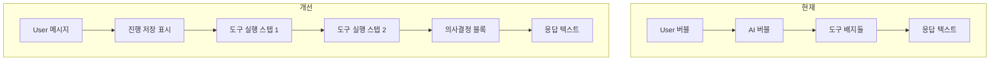
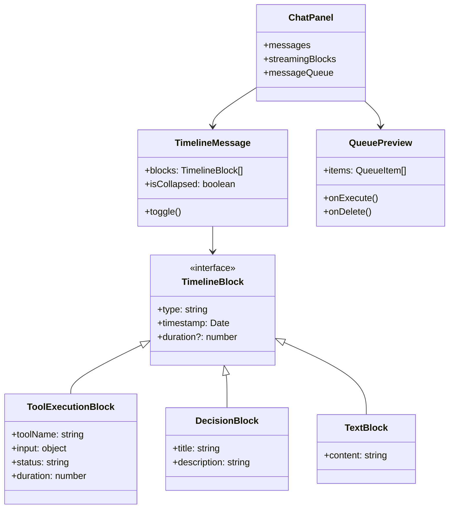

# 005 - 채팅 UI 개선 설계

## 개요

Replit의 채팅 UI를 참고하여 ClaudeShip의 채팅 UI를 개선합니다.

## 현재 상태 분석

### ClaudeShip 현재 UI
- 전통적인 채팅 버블 형태 (User/AI 아바타)
- 도구 사용은 배지/태그 형태로 표시
- 스트리밍 중 도구 실행 상태 표시
- 마크다운 렌더링
- 질문 응답 블록 (AskUserQuestionBlock)

### Replit UI 특징
- 타임라인/스텝 형태의 진행 상황 표시
- 접기/펼치기 기능 ("Show 10 more")
- 의사결정 표시 ("Decided on...")
- 작업 소요 시간 표시 ("8 seconds")
- Queue 섹션 (대기 작업 미리보기)
- 진행 저장 상태 표시

## 문제점

| 문제 | 현재 상태 | Replit |
|------|----------|--------|
| 정보 밀도 | 채팅 버블이 공간 많이 차지 | 스텝별 압축 표시 |
| 접기/펼치기 | ❌ 없음 | ✅ "Show 10 more" |
| 의사결정 표시 | ❌ AI 결정이 명시적이지 않음 | ✅ "Decided on..." |
| 소요 시간 | ❌ 없음 | ✅ 각 작업별 시간 |
| Queue | 숫자만 표시 | 내용 미리보기 가능 |

## 개선 방안

### 1. 타임라인 뷰 전환

현재 채팅 버블 형태를 타임라인 형태로 변경합니다.



### 2. 컴포넌트 구조



### 3. 새로운 UI 요소

#### 3.1 도구 실행 스텝

```
┌─────────────────────────────────────────────────────┐
│ ✓ 파일 읽기  layout.tsx                    (0.3s)  │
├─────────────────────────────────────────────────────┤
│ ⟳ 명령어 실행  pnpm build                  (진행중) │
├─────────────────────────────────────────────────────┤
│ ⚙ Decided on component structure           (2.1s)  │
└─────────────────────────────────────────────────────┘
```

#### 3.2 접기/펼치기

```
┌─────────────────────────────────────────────────────┐
│ ✓ 파일 읽기  package.json                  (0.2s)  │
│ ✓ 파일 읽기  tsconfig.json                 (0.1s)  │
│                                                     │
│ ↕ Show 8 more                                       │
│                                                     │
│ ✓ 파일 수정  App.tsx                       (0.4s)  │
└─────────────────────────────────────────────────────┘
```

#### 3.3 Queue 미리보기

```
┌─────────────────────────────────────────────────────┐
│ ▼ Queue (2)                                    🗑   │
├─────────────────────────────────────────────────────┤
│ ┌─────────────────────────────────────────────┐    │
│ │ 배치가 이렇게 되면 보기가 힘들어 보여...    │ Next│
│ │ 📎 1                                        │    │
│ └─────────────────────────────────────────────┘    │
├─────────────────────────────────────────────────────┤
│ ┌─────────────────────────────────────────────┐    │
│ │ 테스트 코드도 작성해줘                      │    │
│ └─────────────────────────────────────────────┘    │
└─────────────────────────────────────────────────────┘
```

### 4. 데이터 구조 변경

#### 4.1 StreamingBlock 확장

```typescript
interface StreamingBlock {
  id: string;
  type: "text" | "tool_use" | "decision" | "progress_save";
  timestamp: Date;
  duration?: number; // milliseconds

  // 기존 필드
  content?: string;
  tool?: { name: string; input: object };
  status?: "running" | "completed" | "error";

  // 새로운 필드
  decision?: {
    title: string;
    description?: string;
  };
}
```

#### 4.2 Queue 아이템 구조

```typescript
interface QueueItem {
  id: string;
  content: string;
  attachments?: number;
  createdAt: Date;
}
```

### 5. 구현 우선순위

| 우선순위 | 기능 | 난이도 | 영향도 |
|---------|------|--------|--------|
| 1 | 접기/펼치기 기능 | 낮음 | 높음 |
| 2 | 소요 시간 표시 | 낮음 | 중간 |
| 3 | Queue 미리보기 | 중간 | 높음 |
| 4 | 타임라인 뷰 전환 | 높음 | 높음 |
| 5 | 의사결정 블록 | 중간 | 중간 |

## 구현 계획

### Phase 1: 기본 개선 (접기/펼치기 + 시간 표시)
- [ ] StreamingBlock에 timestamp, duration 필드 추가
- [ ] 백엔드에서 도구 실행 시간 측정 및 전송
- [ ] ToolUseBlock에 소요 시간 표시 추가
- [ ] 도구 실행 10개 이상 시 접기/펼치기 UI 추가

### Phase 2: Queue 개선
- [ ] QueuePreview 컴포넌트 생성
- [ ] MessageInput 하단에 Queue 섹션 추가
- [ ] Queue 아이템 삭제/실행 기능

### Phase 3: 타임라인 뷰 (선택)
- [ ] TimelineMessage 컴포넌트 생성
- [ ] 기존 MessageItem을 TimelineMessage로 점진적 교체
- [ ] 의사결정 블록 UI 추가

## 파일 변경 목록

### 프론트엔드
- `apps/web/src/components/chat/StreamingMessage.tsx` - 시간 표시, 접기/펼치기
- `apps/web/src/components/chat/MessageInput.tsx` - Queue 미리보기
- `apps/web/src/components/chat/QueuePreview.tsx` - 새 컴포넌트
- `apps/web/src/stores/useChatStore.ts` - Queue 상태 관리

### 백엔드
- `apps/server/src/chat/chat.service.ts` - 도구 실행 시간 측정

## 참고 자료

- Replit 채팅 UI 스크린샷 (`replit.png`)
- 현재 컴포넌트: `StreamingMessage.tsx`, `MessageItem.tsx`
