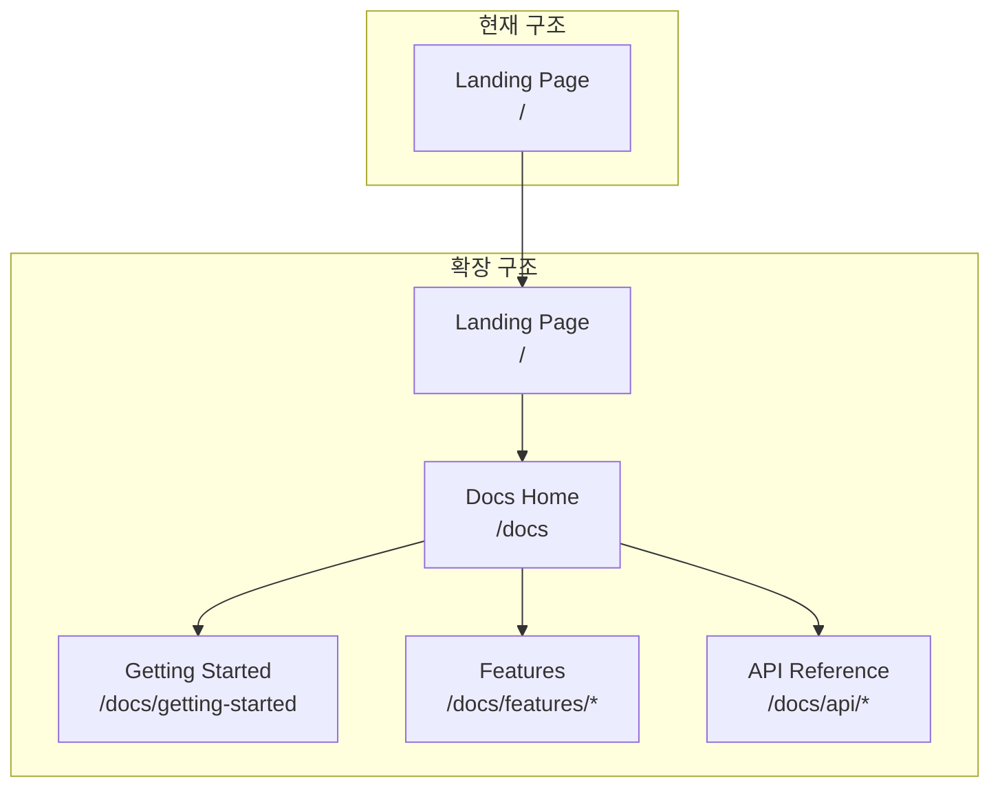

# 007. Docs 뷰어 구축 계획

## 개요

현재 단일 랜딩 페이지인 docs 사이트를 **Nextra 4 기반 다국어 문서 사이트**로 확장합니다.

## 배경

- 현재 docs 사이트는 랜딩 페이지 1개만 존재
- 기능 문서화가 필요함
- 다국어(한국어/영어) 지원 필요
- GitHub Pages 정적 배포 유지

## 기술 스택

| 항목 | 선택 | 이유 |
|------|------|------|
| 프레임워크 | Nextra 4 | App Router 지원, Next.js 15 호환, MDX 기반 |
| 언어 | 한국어 + 영어 | 글로벌 사용자 대응 |
| 배포 | GitHub Pages | 기존 인프라 유지 |
| 검색 | Pagefind | Nextra 4 내장, 정적 검색 지원 |

## 아키텍처



## 폴더 구조

```
docs/
├── content/                    # 문서 콘텐츠 (새로 생성)
│   ├── en/                     # 영어 문서
│   │   ├── _meta.ts            # 사이드바 설정
│   │   ├── index.mdx           # 문서 홈
│   │   ├── getting-started.mdx
│   │   ├── features/
│   │   │   ├── _meta.ts
│   │   │   ├── chat.mdx
│   │   │   ├── preview.mdx
│   │   │   ├── file-explorer.mdx
│   │   │   ├── terminal.mdx
│   │   │   └── database.mdx
│   │   └── api-reference/
│   │       ├── _meta.ts
│   │       └── ...
│   └── ko/                     # 한국어 문서 (동일 구조)
│       ├── _meta.ts
│       ├── index.mdx
│       └── ...
├── src/
│   ├── app/
│   │   ├── page.tsx            # 기존 랜딩 페이지 (유지)
│   │   ├── docs/
│   │   │   └── [[...mdxPath]]/
│   │   │       └── page.tsx    # Nextra 문서 라우트
│   │   └── ...
│   └── components/
├── mdx-components.tsx          # MDX 커스텀 컴포넌트
└── next.config.mjs             # Nextra 설정
```

## 다국어 지원 구조

```mermaid
flowchart LR
    subgraph "URL 구조"
        A[/docs] --> B[영어 기본]
        C[/ko/docs] --> D[한국어]
    end

    subgraph "파일 구조"
        E[content/en/] --> F[영어 MDX]
        G[content/ko/] --> H[한국어 MDX]
    end

    B --> E
    D --> G
```

## 구현 단계

### 1단계: Nextra 4 설치 및 기본 설정

**작업 내용:**
- `nextra`, `nextra-theme-docs` 패키지 설치
- `next.config.js` → `next.config.mjs` 변환
- Nextra 플러그인 설정

**next.config.mjs 예시:**
```javascript
import nextra from 'nextra'

const withNextra = nextra({
  contentDirBasePath: '/docs',
  defaultShowCopyCode: true,
})

const isProd = process.env.NODE_ENV === 'production'
const basePath = isProd ? '/ClaudeShip' : ''

export default withNextra({
  output: 'export',
  trailingSlash: true,
  images: { unoptimized: true },
  basePath,
  assetPrefix: isProd ? '/ClaudeShip/' : '',
})
```

### 2단계: 다국어(i18n) 설정

**작업 내용:**
- next.config.mjs에 i18n 설정 추가
- 언어별 콘텐츠 폴더 구조 생성
- 언어 전환 UI 설정

**i18n 설정:**
```javascript
// next.config.mjs
{
  i18n: {
    locales: ['en', 'ko'],
    defaultLocale: 'en',
  }
}
```

### 3단계: 문서 콘텐츠 구조 생성

**문서 목차 (계획):**

| 섹션 | 페이지 | 설명 |
|------|--------|------|
| 소개 | index.mdx | ClaudeShip 개요 |
| 시작하기 | getting-started.mdx | 설치 및 첫 실행 |
| 기능 | features/ | 주요 기능 설명 |
| ├─ Chat | chat.mdx | AI 채팅 인터페이스 |
| ├─ Preview | preview.mdx | 실시간 프리뷰 |
| ├─ File Explorer | file-explorer.mdx | 파일 탐색기 |
| ├─ Terminal | terminal.mdx | 터미널 기능 |
| └─ Database | database.mdx | 데이터베이스 관리 |
| API | api-reference/ | API 레퍼런스 |

### 4단계: 문서 라우트 설정

**작업 내용:**
- `src/app/docs/[[...mdxPath]]/page.tsx` 생성
- Nextra의 MDX 렌더링 연결
- 레이아웃 설정

### 5단계: 랜딩 페이지 연동

**작업 내용:**
- 네비게이션에 "Docs" 링크 추가
- 랜딩 페이지 CTA에서 문서로 연결

### 6단계: 스타일링

**작업 내용:**
- Nextra 테마 커스터마이징 (색상, 로고)
- 기존 Tailwind 스타일과 통합
- 다크 모드 지원

### 7단계: 빌드 및 배포

**작업 내용:**
- 정적 export 동작 확인
- sitemap.ts 업데이트 (문서 페이지 추가)
- GitHub Pages 배포 테스트

## Nextra 4 주요 기능

| 기능 | 설명 | 지원 여부 |
|------|------|----------|
| App Router | Next.js 15 App Router 기반 | ✅ |
| MDX | 마크다운 + React 컴포넌트 | ✅ |
| 다국어 | i18n 라우팅 지원 | ✅ |
| 검색 | Pagefind 기반 정적 검색 | ✅ |
| 정적 Export | GitHub Pages 배포 | ✅ |
| 사이드바 | _meta.ts로 자동 생성 | ✅ |
| 다크 모드 | 시스템 설정 연동 | ✅ |
| 코드 하이라이팅 | Shiki 기반 | ✅ |

## 제약 사항

1. **자동 언어 감지 불가**: 정적 export에서는 미들웨어가 동작하지 않아 자동 언어 감지 불가. 수동 언어 전환만 가능.

2. **basePath 주의**: GitHub Pages의 `/ClaudeShip` basePath와 Nextra 설정 호환성 확인 필요.

## 검증 방법

1. `pnpm build` - 빌드 성공 확인
2. `pnpm dev` - 개발 서버 실행
3. 다음 항목 테스트:
   - `/` - 기존 랜딩 페이지 정상 동작
   - `/docs` - 문서 홈 페이지
   - `/docs/getting-started` - 문서 페이지
   - `/ko/docs` - 한국어 문서
   - 언어 전환 (EN ↔ KO)
   - 사이드바 네비게이션
   - 검색 기능

## 예상 일정

| 단계 | 작업 |
|------|------|
| 1단계 | Nextra 설치 및 기본 설정 |
| 2단계 | 다국어 설정 |
| 3단계 | 문서 구조 생성 |
| 4단계 | 라우트 설정 |
| 5단계 | 랜딩 페이지 연동 |
| 6단계 | 스타일링 |
| 7단계 | 빌드 및 배포 |

## 참고 자료

- [Nextra 4 공식 문서](https://nextra.site/docs)
- [Nextra i18n 가이드](https://nextra.site/docs/guide/i18n)
- [Nextra Static Export](https://nextra.site/docs/guide/static-exports)
