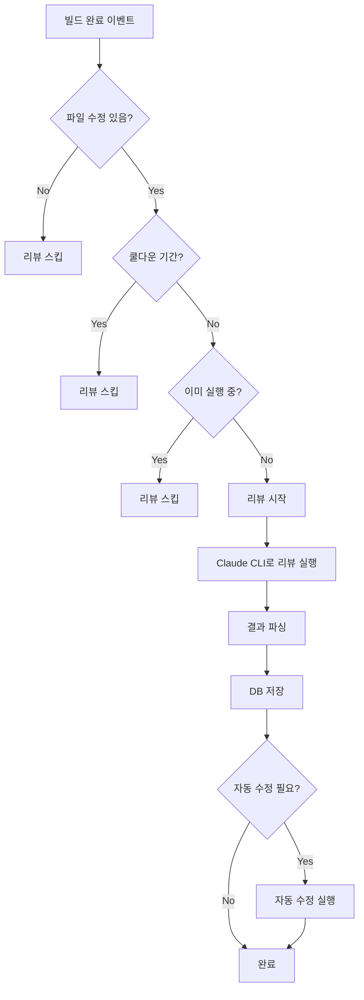
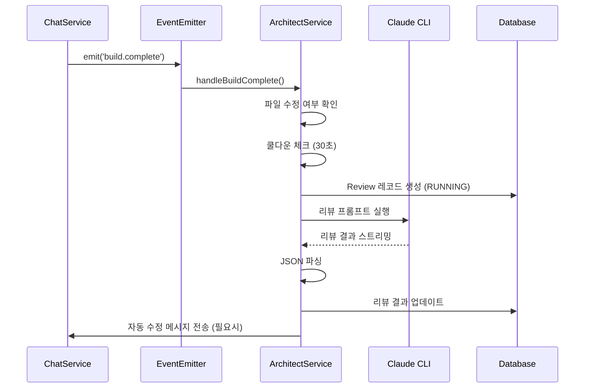

# 아키텍트 리뷰 기능 설계

> 작성일: 2025-12-30
> 버전: 1.0

---

## 1. 개요

### 1.1 목적

AI 기반 자동 코드 리뷰 시스템을 제공하여 코드 품질을 자동으로 검사하고 개선 제안을 제공합니다.

### 1.2 주요 기능

| 기능 | 설명 |
|------|------|
| **자동 리뷰 트리거** | 파일 수정 후 빌드 완료 시 자동으로 리뷰 실행 |
| **코드 점수 매기기** | 0-100점 기준 코드 품질 점수 |
| **이슈 감지** | 심각도별(critical, high, medium, low) 이슈 분류 |
| **자동 수정** | critical/high 이슈 중 자동 수정 가능한 항목 자동 처리 |
| **리뷰 히스토리** | 프로젝트별 리뷰 기록 저장 및 조회 |

---

## 2. 시스템 아키텍처

### 2.1 리뷰 플로우



### 2.2 이벤트 기반 트리거



---

## 3. 데이터 모델

### 3.1 Review 모델

```prisma
model Review {
  id               String       @id @default(uuid())
  projectId        String
  status           ReviewStatus @default(RUNNING)
  triggerMessageId String?      // 리뷰를 트리거한 메시지
  summary          String?
  overallScore     Int?         // 0-100
  issues           String?      // JSON: ReviewIssue[]
  strengths        String?      // JSON: string[]
  recommendations  String?      // JSON: string[]
  cost             Float?       // API 비용
  createdAt        DateTime     @default(now())
  completedAt      DateTime?

  project          Project      @relation(fields: [projectId], references: [id])
}

enum ReviewStatus {
  RUNNING
  COMPLETED
  FAILED
  AUTO_FIXING
}
```

### 3.2 ReviewIssue 타입

```typescript
interface ReviewIssue {
  title: string;
  description: string;
  severity: 'critical' | 'high' | 'medium' | 'low';
  file?: string;
  line?: number;
  suggestion?: string;
  autoFixable?: boolean;
}

interface ReviewResult {
  summary: string;
  overallScore: number;
  issues: ReviewIssue[];
  strengths: string[];
  recommendations: string[];
}
```

---

## 4. API 설계

### 4.1 엔드포인트

| Method | Endpoint | 설명 |
|--------|----------|------|
| GET | /api/projects/:id/reviews | 리뷰 목록 조회 |
| GET | /api/projects/:id/reviews/:reviewId | 특정 리뷰 상세 조회 |
| POST | /api/projects/:id/reviews/trigger | 수동 리뷰 트리거 |
| GET | /api/projects/:id/reviews/stream | SSE 리뷰 이벤트 스트림 |

### 4.2 응답 형식

```typescript
// GET /api/projects/:id/reviews
interface ReviewResponse {
  id: string;
  status: ReviewStatus;
  summary: string | null;
  overallScore: number | null;
  issues: ReviewIssue[];
  strengths: string[];
  recommendations: string[];
  cost: number | null;
  createdAt: string;
  completedAt: string | null;
}
```

### 4.3 SSE 이벤트

```typescript
interface ReviewStreamEvent {
  type: 'start' | 'progress' | 'complete' | 'error';
  reviewId?: string;
  data?: ReviewResult | { error: string };
}
```

---

## 5. 핵심 로직

### 5.1 리뷰 트리거 조건

```typescript
const FILE_MODIFY_TOOLS = ['Write', 'Edit', 'MultiEdit'];
const REVIEW_COOLDOWN_MS = 30_000; // 30초

// 리뷰 실행 조건:
// 1. 파일 수정 도구 사용됨
// 2. 마지막 리뷰 후 30초 경과
// 3. 현재 실행 중인 리뷰 없음
```

### 5.2 자동 수정 조건

```typescript
// 자동 수정 대상:
// - severity: 'critical' 또는 'high'
// - autoFixable: true
```

### 5.3 리뷰 프롬프트

```typescript
// prompts/review-prompt.ts
export function buildReviewPrompt(projectPath: string): string {
  return `
[Code Review Request]
프로젝트 경로: ${projectPath}

다음 형식으로 코드 리뷰를 제공해주세요:
{
  "summary": "전체 요약",
  "overallScore": 85,
  "issues": [...],
  "strengths": [...],
  "recommendations": [...]
}
...
  `;
}
```

---

## 6. 구현 파일

| 파일 | 설명 |
|------|------|
| `apps/server/src/architect/architect.module.ts` | 모듈 정의 |
| `apps/server/src/architect/architect.controller.ts` | API 컨트롤러 |
| `apps/server/src/architect/architect.service.ts` | 리뷰 서비스 로직 |
| `apps/server/src/architect/prompts/review-prompt.ts` | 리뷰 프롬프트 빌더 |
| `packages/shared/src/types/review.ts` | 공유 타입 정의 |

---

## 7. 참고

- [008-backend-feature-design.md](./008-backend-feature-design.md) - 백엔드 기본 구조
- [003-fullstack-feature.md](./003-fullstack-feature.md) - 채팅 서비스 연동
