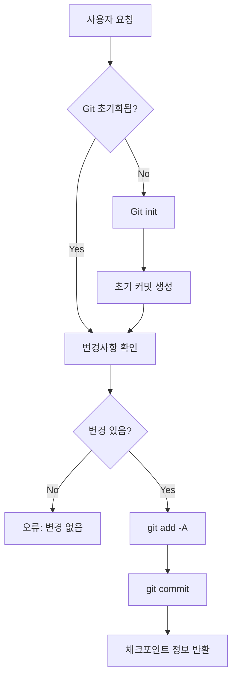
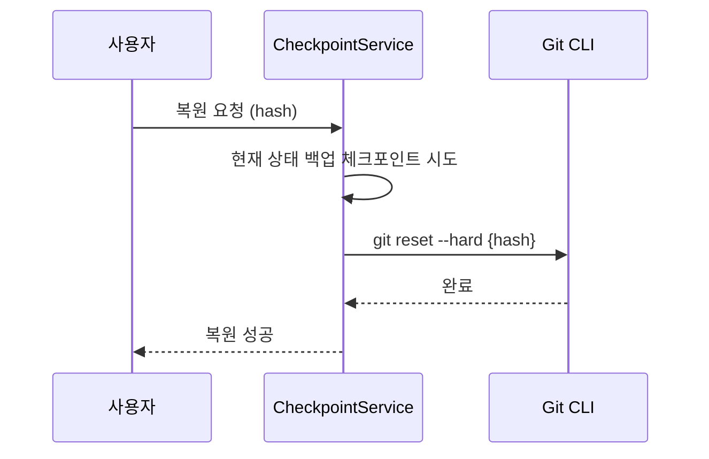

# 체크포인트 기능 설계

> 작성일: 2025-12-30
> 버전: 1.0

---

## 1. 개요

### 1.1 목적

Git 기반 체크포인트 시스템을 통해 프로젝트의 버전을 관리하고, 이전 상태로 복원할 수 있는 기능을 제공합니다.

### 1.2 주요 기능

| 기능 | 설명 |
|------|------|
| **체크포인트 생성** | 현재 상태를 Git 커밋으로 저장 |
| **자동 체크포인트** | 변경사항이 있을 때 자동으로 스냅샷 생성 |
| **체크포인트 목록** | 프로젝트의 체크포인트(커밋) 히스토리 조회 |
| **Diff 비교** | 두 체크포인트 간 변경사항 비교 |
| **복원** | 특정 체크포인트로 프로젝트 상태 복원 |
| **상태 조회** | 현재 작업 디렉토리의 변경 상태 확인 |

---

## 2. 시스템 아키텍처

### 2.1 체크포인트 플로우



### 2.2 복원 플로우



---

## 3. 데이터 모델

### 3.1 Checkpoint 인터페이스

```typescript
interface Checkpoint {
  id: string;          // 짧은 해시 (8자)
  hash: string;        // 전체 커밋 해시 (40자)
  message: string;     // 커밋 메시지
  author: string;      // 작성자
  timestamp: number;   // Unix timestamp (ms)
  filesChanged: number;// 변경된 파일 수
  insertions: number;  // 추가된 라인 수
  deletions: number;   // 삭제된 라인 수
}
```

### 3.2 CheckpointDiff 인터페이스

```typescript
interface CheckpointDiff {
  files: FileDiff[];
}

interface FileDiff {
  path: string;
  status: 'added' | 'modified' | 'deleted';
  additions: number;
  deletions: number;
  diff: string;  // Git diff 출력
}
```

---

## 4. API 설계

### 4.1 엔드포인트

| Method | Endpoint | 설명 |
|--------|----------|------|
| GET | /api/projects/:id/checkpoints | 체크포인트 목록 조회 |
| POST | /api/projects/:id/checkpoints | 새 체크포인트 생성 |
| POST | /api/projects/:id/checkpoints/auto | 자동 체크포인트 |
| GET | /api/projects/:id/checkpoints/status | 현재 변경 상태 조회 |
| GET | /api/projects/:id/checkpoints/:hash/diff | Diff 조회 |
| POST | /api/projects/:id/checkpoints/:hash/restore | 복원 |

### 4.2 요청/응답 형식

```typescript
// POST /api/projects/:id/checkpoints
interface CreateCheckpointDto {
  message: string;
}

// GET /api/projects/:id/checkpoints
interface CheckpointListResponse {
  checkpoints: Checkpoint[];
}

// GET /api/projects/:id/checkpoints/status
interface StatusResponse {
  hasChanges: boolean;
  files: Array<{
    path: string;
    status: 'added' | 'modified' | 'deleted' | 'renamed';
  }>;
}
```

---

## 5. 핵심 로직

### 5.1 Git 명령어 래퍼

```typescript
private executeGit(projectPath: string, args: string[]): Promise<string> {
  return new Promise((resolve, reject) => {
    const proc = spawn('git', args, {
      cwd: projectPath,
      shell: true,
    });
    // stdout, stderr 처리
  });
}
```

### 5.2 Git 초기화

```typescript
async initializeGit(projectId: string): Promise<void> {
  // 1. .git 폴더 존재 확인
  // 2. 없으면 git init
  // 3. user.email, user.name 설정
  // 4. 초기 커밋 생성 (--allow-empty)
}
```

### 5.3 체크포인트 생성

```typescript
async createCheckpoint(projectId: string, message: string): Promise<Checkpoint> {
  // 1. Git 초기화 확인
  // 2. git status --porcelain으로 변경 확인
  // 3. git add -A
  // 4. git commit -m {message}
  // 5. 커밋 정보 반환
}
```

### 5.4 복원

```typescript
async restoreCheckpoint(projectId: string, hash: string): Promise<void> {
  // 1. 현재 상태 백업 체크포인트 시도
  // 2. git reset --hard {hash}
}
```

---

## 6. Git 출력 파싱

### 6.1 로그 파싱

```bash
# 사용 명령어
git log --max-count=50 --format=%H|%s|%an|%at --shortstat
```

```typescript
// 출력 예시
// a1b2c3d4...|Initial checkpoint|ClaudeShip|1703900000
//  3 files changed, 100 insertions(+), 20 deletions(-)
```

### 6.2 Diff 파싱

```bash
# 사용 명령어
git diff {from} {to} --no-color
```

---

## 7. 구현 파일

| 파일 | 설명 |
|------|------|
| `apps/server/src/checkpoint/checkpoint.module.ts` | 모듈 정의 |
| `apps/server/src/checkpoint/checkpoint.controller.ts` | API 컨트롤러 |
| `apps/server/src/checkpoint/checkpoint.service.ts` | 체크포인트 서비스 로직 |

---

## 8. 보안 고려사항

| 위험 | 대응 |
|------|------|
| 민감 파일 커밋 | .gitignore 자동 생성 권장 |
| 대용량 파일 | .git 폴더 크기 모니터링 |
| 무한 히스토리 | 체크포인트 조회 수 제한 (기본 50개) |

---

## 9. 참고

- [004-preview-enhancement.md](./004-preview-enhancement.md) - 체크포인트 연동 계획
- [Git Documentation](https://git-scm.com/docs)
