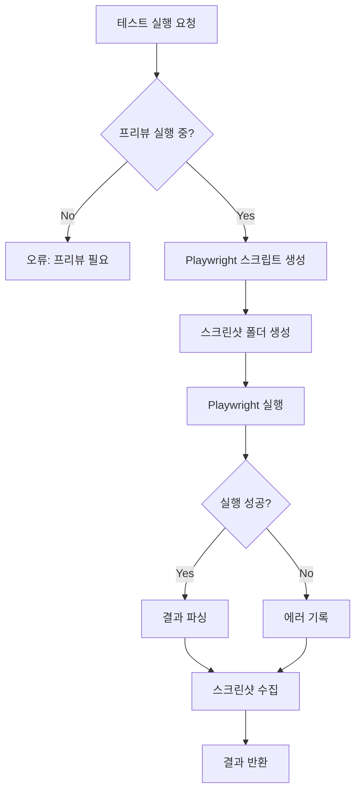
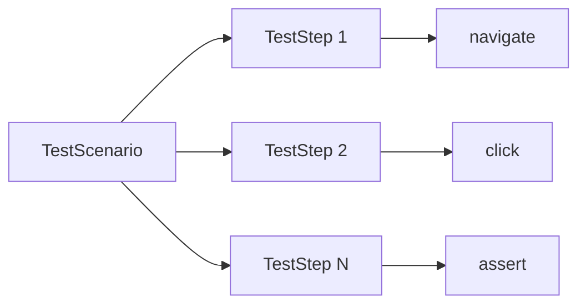

# E2E 테스팅 기능 설계

> 작성일: 2025-12-30
> 버전: 1.0

---

## 1. 개요

### 1.1 목적

Playwright 기반 E2E(End-to-End) 테스트를 통해 사용자가 정의한 테스트 시나리오를 자동으로 실행하고 결과를 확인할 수 있는 기능을 제공합니다.

### 1.2 주요 기능

| 기능 | 설명 |
|------|------|
| **시나리오 관리** | 테스트 시나리오 CRUD |
| **테스트 실행** | Playwright로 시나리오 실행 |
| **스크린샷 캡처** | 테스트 중 화면 캡처 |
| **결과 조회** | 테스트 성공/실패 결과 및 상세 정보 |
| **실시간 스트림** | 테스트 진행 상태 SSE 스트림 |

---

## 2. 시스템 아키텍처

### 2.1 테스트 실행 플로우



### 2.2 시나리오 구조



---

## 3. 데이터 모델

### 3.1 TestScenario 인터페이스

```typescript
interface TestScenario {
  id: string;
  name: string;
  steps: TestStep[];
  createdAt: number;
}
```

### 3.2 TestStep 타입

```typescript
interface TestStep {
  action: 'navigate' | 'click' | 'fill' | 'waitFor' | 'screenshot' | 'assert';
  selector?: string;   // CSS 선택자
  url?: string;        // navigate용
  value?: string;      // fill용
  name?: string;       // screenshot 파일명
  expected?: string;   // assert용
}
```

### 3.3 TestResult 인터페이스

```typescript
interface TestResult {
  scenarioId: string;
  scenarioName: string;
  status: 'passed' | 'failed' | 'running';
  startTime: number;
  endTime?: number;
  steps: StepResult[];
  error?: string;
  screenshots: string[];
}

interface StepResult {
  step: TestStep;
  status: 'passed' | 'failed' | 'skipped';
  duration: number;
  error?: string;
  screenshot?: string;
}
```

---

## 4. API 설계

### 4.1 엔드포인트

| Method | Endpoint | 설명 |
|--------|----------|------|
| GET | /api/projects/:id/tests | 시나리오 목록 |
| GET | /api/projects/:id/tests/:scenarioId | 시나리오 상세 |
| POST | /api/projects/:id/tests | 시나리오 생성 |
| PUT | /api/projects/:id/tests/:scenarioId | 시나리오 수정 |
| DELETE | /api/projects/:id/tests/:scenarioId | 시나리오 삭제 |
| POST | /api/projects/:id/tests/:scenarioId/run | 테스트 실행 |
| POST | /api/projects/:id/tests/:scenarioId/stop | 테스트 중지 |
| GET | /api/projects/:id/tests/stream | SSE 테스트 이벤트 |

### 4.2 요청/응답 형식

```typescript
// POST /api/projects/:id/tests
interface CreateScenarioDto {
  name: string;
  steps: TestStep[];
}

// POST /api/projects/:id/tests/:scenarioId/run
// Response
interface TestResultResponse extends TestResult {}
```

### 4.3 SSE 이벤트

```typescript
interface TestEvent {
  type: 'step' | 'complete' | 'error';
  scenarioId: string;
  data: StepResult | TestResult | { error: string };
}
```

---

## 5. Playwright 스크립트 생성

### 5.1 지원 액션

| 액션 | Playwright 코드 |
|------|----------------|
| `navigate` | `await page.goto(url)` |
| `click` | `await page.click(selector)` |
| `fill` | `await page.fill(selector, value)` |
| `waitFor` | `await page.waitForSelector(selector)` |
| `screenshot` | `await page.screenshot({ path })` |
| `assert` | `await expect(page.locator(selector)).toBeVisible()` |

### 5.2 생성되는 스크립트 구조

```javascript
const { chromium, expect } = require('@playwright/test');

(async () => {
  const browser = await chromium.launch({ headless: true });
  const context = await browser.newContext();
  const page = await context.newPage();

  try {
    // Step 1: navigate
    await page.goto('http://localhost:3000');
    console.log('STEP_PASSED:0');

    // Step 2: click
    await page.click('button.submit');
    console.log('STEP_PASSED:1');

    // ... 추가 스텝들

    console.log('TEST_PASSED');
  } catch (error) {
    console.error('TEST_FAILED:', error.message);
    process.exit(1);
  } finally {
    await browser.close();
  }
})();
```

---

## 6. 핵심 로직

### 6.1 테스트 실행 조건

```typescript
// 프리뷰가 실행 중이어야 테스트 가능
const status = await this.previewService.getStatus(projectId);
if (status.status !== 'running' || !status.url) {
  throw new BadRequestException('Preview must be running to execute tests');
}
```

### 6.2 스크립트 실행

```typescript
private executePlaywright(testFilePath: string, cwd: string): Promise<string> {
  return new Promise((resolve, reject) => {
    // 1. npx playwright test 시도
    // 2. 실패 시 node 직접 실행 폴백
    // 3. 60초 타임아웃
  });
}
```

### 6.3 결과 파싱

```typescript
private parseTestOutput(steps: TestStep[], output: string): StepResult[] {
  return steps.map((step, i) => {
    const passed = output.includes(`STEP_PASSED:${i}`);
    const skipped = output.includes(`STEP_SKIPPED:${i}`);
    return {
      step,
      status: skipped ? 'skipped' : passed ? 'passed' : 'failed',
      duration: 0,
    };
  });
}
```

---

## 7. 스크린샷 관리

### 7.1 저장 위치

```
{projectPath}/.test-screenshots/
├── step-0.png
├── step-1.png
└── custom-name.png
```

### 7.2 정리

```typescript
// 테스트 완료 후 스크린샷 수집
const files = await fs.readdir(screenshotsDir);
result.screenshots = files
  .filter(f => f.endsWith('.png'))
  .map(f => path.join(screenshotsDir, f));
```

---

## 8. 구현 파일

| 파일 | 설명 |
|------|------|
| `apps/server/src/testing/testing.module.ts` | 모듈 정의 |
| `apps/server/src/testing/testing.controller.ts` | API 컨트롤러 |
| `apps/server/src/testing/testing.service.ts` | 테스팅 서비스 로직 |

---

## 9. 의존성

- **Playwright**: 브라우저 자동화
- **PreviewService**: 테스트 대상 URL 제공

```bash
# 프로젝트에 Playwright 설치 필요
npm install -D @playwright/test
npx playwright install chromium
```

---

## 10. 제한사항 및 향후 개선

| 현재 제한사항 | 향후 개선 방향 |
|--------------|---------------|
| 메모리 기반 시나리오 저장 | DB 저장 |
| 단일 시나리오 순차 실행 | 병렬 실행 지원 |
| 기본 액션만 지원 | 커스텀 스크립트 지원 |
| Headless 모드만 | Headed 모드 옵션 |

---

## 11. 참고

- [Playwright Documentation](https://playwright.dev/docs/intro)
- [004-preview-enhancement.md](./004-preview-enhancement.md) - 프리뷰 연동
