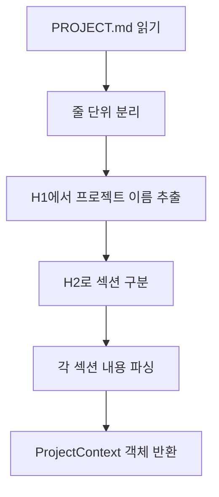
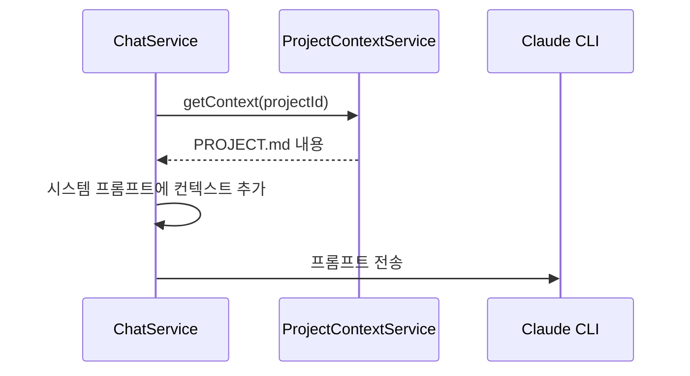

# 프로젝트 컨텍스트 기능 설계

> 작성일: 2025-12-30
> 버전: 1.0

---

## 1. 개요

### 1.1 목적

`PROJECT.md` 파일을 통해 프로젝트의 컨텍스트(기술 스택, 디자인 방향, 코딩 컨벤션 등)를 관리하여 AI 에이전트가 프로젝트에 맞는 코드를 생성할 수 있도록 합니다.

### 1.2 주요 기능

| 기능 | 설명 |
|------|------|
| **컨텍스트 조회** | PROJECT.md 내용 읽기 |
| **컨텍스트 생성** | 기본 템플릿으로 PROJECT.md 생성 |
| **컨텍스트 수정** | PROJECT.md 내용 업데이트 |
| **컨텍스트 삭제** | PROJECT.md 삭제 |
| **파싱** | 마크다운을 구조화된 객체로 변환 |
| **자동 생성** | 프로젝트 생성 시 타입에 맞는 컨텍스트 자동 생성 |

---

## 2. PROJECT.md 구조

### 2.1 기본 템플릿

```markdown
# Project Name

## Overview
[Project description]

## Tech Stack
- Frontend: Next.js 15, TypeScript, Tailwind CSS
- Backend: Express, Prisma, SQLite
- Auth: NextAuth.js

## Design Direction
- Style: Minimal, Clean
- Color Scheme: Blue-based primary
- Tone: Professional, Trustworthy

## Core Features
1. User Authentication
2. Dashboard
3. ...

## Coding Conventions
- Components: PascalCase
- Functions: camelCase
- Files: kebab-case

## Agent Instructions
- Respond in Korean
- Request confirmation at each step
- Use shadcn/ui components
```

### 2.2 섹션별 역할

| 섹션 | 역할 |
|------|------|
| **Overview** | 프로젝트 개요 및 목적 |
| **Tech Stack** | 사용 기술 스택 |
| **Design Direction** | UI/UX 디자인 방향 |
| **Core Features** | 핵심 기능 목록 |
| **Coding Conventions** | 코드 작성 규칙 |
| **Agent Instructions** | AI 에이전트 지시사항 |

---

## 3. 데이터 모델

### 3.1 ProjectContext 인터페이스

```typescript
interface ProjectContext {
  name: string;
  overview: string;
  techStack: {
    frontend: string[];
    backend: string[];
    database: string[];
  };
  designDirection: {
    style: string;
    colorScheme: string;
    tone: string;
  };
  coreFeatures: string[];
  codingConventions: {
    components: string;
    functions: string;
    files: string;
  };
  agentInstructions: string[];
}
```

---

## 4. API 설계

### 4.1 엔드포인트

| Method | Endpoint | 설명 |
|--------|----------|------|
| GET | /api/projects/:id/context | 컨텍스트 조회 (Raw) |
| GET | /api/projects/:id/context/parsed | 컨텍스트 조회 (파싱됨) |
| POST | /api/projects/:id/context | 컨텍스트 생성 |
| PUT | /api/projects/:id/context | 컨텍스트 수정 |
| DELETE | /api/projects/:id/context | 컨텍스트 삭제 |
| GET | /api/projects/:id/context/exists | 존재 여부 확인 |
| GET | /api/context/template | 기본 템플릿 조회 |

### 4.2 요청/응답 형식

```typescript
// GET /api/projects/:id/context
interface ContextResponse {
  content: string;  // Raw markdown
}

// GET /api/projects/:id/context/parsed
interface ParsedContextResponse {
  context: ProjectContext;
}

// POST /api/projects/:id/context
interface CreateContextDto {
  content?: string;  // 없으면 기본 템플릿 사용
}

// PUT /api/projects/:id/context
interface UpdateContextDto {
  content: string;
}
```

---

## 5. 마크다운 파싱

### 5.1 파싱 로직



### 5.2 파싱 규칙

```typescript
// H1 -> 프로젝트 이름
// # Project Name

// H2 -> 섹션 구분
// ## Overview

// 불릿 리스트 -> 배열
// - Item 1
// - Item 2

// 키:값 형식 -> 객체 속성
// - Frontend: Next.js, TypeScript

// 번호 리스트 -> 순서 배열
// 1. Feature 1
// 2. Feature 2
```

---

## 6. 핵심 로직

### 6.1 컨텍스트 조회

```typescript
async getContext(projectId: string): Promise<string | null> {
  const projectPath = await this.projectService.getProjectPath(projectId);
  const contextPath = path.join(projectPath, 'PROJECT.md');

  try {
    return await fs.readFile(contextPath, 'utf-8');
  } catch {
    return null;  // 파일 없음
  }
}
```

### 6.2 프로젝트 타입별 컨텍스트 자동 생성

```typescript
generateContextFromProject(
  name: string,
  projectType: string,
  backendFramework: string | null,
  description?: string
): string {
  const isFullstack = backendFramework && backendFramework !== 'NONE';

  let techStack = '';
  if (projectType === 'WEB') {
    techStack = '- Frontend: Next.js 15, TypeScript, Tailwind CSS, shadcn/ui';
    if (isFullstack) {
      if (backendFramework === 'EXPRESS') {
        techStack += '\n- Backend: Express, Prisma, SQLite';
      } else if (backendFramework === 'FASTAPI') {
        techStack += '\n- Backend: FastAPI, SQLAlchemy, SQLite';
      }
    }
  }

  return `# ${name}

## Overview
${description || '[Project description]'}

## Tech Stack
${techStack}
...`;
}
```

---

## 7. AI 에이전트 연동

### 7.1 시스템 프롬프트 통합



### 7.2 컨텍스트 활용

```typescript
// ChatService에서 활용
const context = await this.projectContextService.getContext(projectId);
const systemPrompt = `
${baseSystemPrompt}

=== Project Context ===
${context || 'No project context defined'}
`;
```

---

## 8. 구현 파일

| 파일 | 설명 |
|------|------|
| `apps/server/src/project-context/project-context.module.ts` | 모듈 정의 |
| `apps/server/src/project-context/project-context.controller.ts` | API 컨트롤러 |
| `apps/server/src/project-context/project-context.service.ts` | 컨텍스트 서비스 로직 |

---

## 9. 사용 시나리오

### 9.1 새 프로젝트 생성 시

1. 프로젝트 생성 요청
2. 프로젝트 타입/백엔드 스택 기반 PROJECT.md 자동 생성
3. 사용자가 필요에 따라 수정

### 9.2 기존 프로젝트 가져오기

1. 프로젝트 경로에서 PROJECT.md 감지
2. 있으면 자동으로 컨텍스트로 사용
3. 없으면 사용자에게 생성 권유

---

## 10. 참고

- [003-fullstack-feature.md](./003-fullstack-feature.md) - 프로젝트 타입별 스택
- [CLAUDE.md](../../CLAUDE.md) - 유사한 컨텍스트 파일 개념
