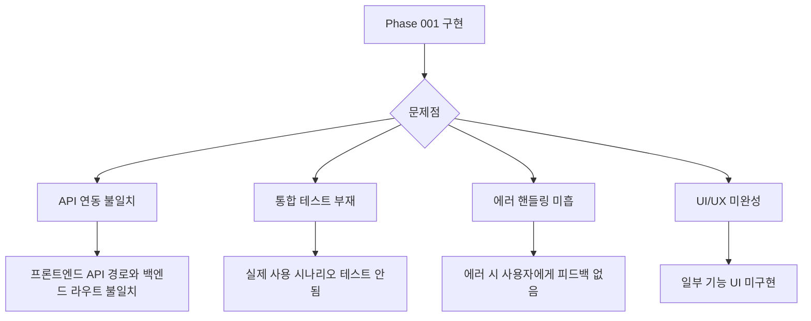
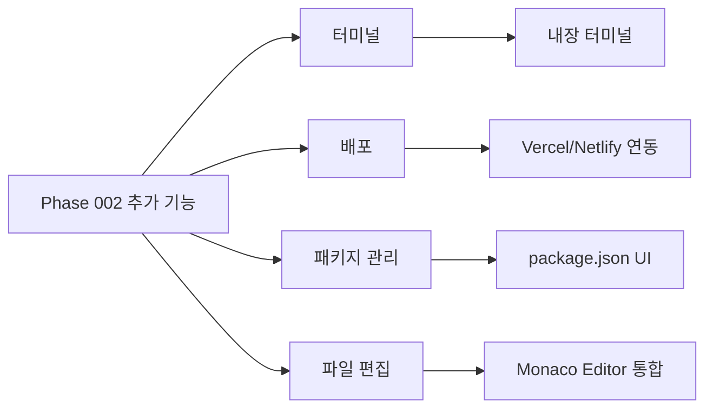

# Phase 002: 기능 고도화 Overview

> 작성일: 2025-12-30
> 상태: 진행 중

---

## 1. Phase 002 목표

Phase 001에서 구현된 기능들이 **실제로 동작하지 않거나 불완전한 상태**입니다. Phase 002의 목표는:

1. **기존 기능 정상화** - 구현되었지만 동작하지 않는 기능들 수정
2. **기능 고도화** - 기본 구현에서 실용적인 수준으로 개선
3. **추가 기능 식별** - 리플릿 등 유사 서비스 대비 누락된 기능 파악

---

## 2. 현재 상황 분석

### 2.1 구현 현황 요약

| 기능 | 백엔드 | 프론트엔드 | 동작 상태 | 문제점 |
|------|--------|-----------|----------|--------|
| **Checkpoint** | ✅ 있음 | ✅ 있음 | ⚠️ 미확인 | Git 연동 테스트 필요 |
| **Architect (Review)** | ✅ 있음 | ✅ 있음 | ⚠️ 미확인 | 자동 트리거 동작 확인 필요 |
| **Database Viewer** | ✅ 있음 | ✅ 있음 | ⚠️ 미확인 | Prisma 연동 테스트 필요 |
| **Testing (E2E)** | ✅ 있음 | ✅ 있음 | ⚠️ 미확인 | Playwright 의존성 문제 |
| **Env Manager** | ✅ 있음 | ✅ 있음 | ⚠️ 미확인 | API 엔드포인트 불일치 가능 |
| **Project Context** | ✅ 있음 | ❌ 없음 | ❌ 미동작 | UI 없음 |

### 2.2 공통 문제점

### 2.3 기능별 상세 분석

#### Checkpoint (체크포인트)
- **백엔드**: `apps/server/src/checkpoint/`
- **프론트엔드**: `CheckpointPanel.tsx`
- **예상 문제**:
  - Git 초기화 안됨 시 오류
  - 대용량 프로젝트 성능 문제
  - diff 표시 UI 렌더링 이슈

#### Architect (코드 리뷰)
- **백엔드**: `apps/server/src/architect/`
- **프론트엔드**: `ArchitectPanel.tsx`
- **예상 문제**:
  - `build.complete` 이벤트 발생 안함
  - Claude CLI 연동 오류
  - 리뷰 결과 파싱 실패

#### Database Viewer (DB 뷰어)
- **백엔드**: `apps/server/src/database/`
- **프론트엔드**: `DatabasePanel.tsx`
- **예상 문제**:
  - Prisma 스키마 없는 프로젝트 오류
  - SQLite vs PostgreSQL 처리
  - 대용량 테이블 페이지네이션

#### Testing (E2E 테스팅)
- **백엔드**: `apps/server/src/testing/`
- **프론트엔드**: `TestRunner.tsx`
- **예상 문제**:
  - Playwright 미설치
  - 프리뷰 미실행 시 테스트 불가
  - 시나리오 저장 안됨 (메모리 기반)

#### Env Manager (환경변수)
- **백엔드**: `apps/server/src/env/`
- **프론트엔드**: `EnvPanel.tsx`
- **예상 문제**:
  - API 경로 불일치 (`/env/file` vs `/env/:path`)
  - .env 파일 없는 경우 처리

#### Project Context (프로젝트 컨텍스트)
- **백엔드**: `apps/server/src/project-context/`
- **프론트엔드**: ❌ 없음
- **문제**: UI가 전혀 없음

---

## 3. Phase 002 작업 목록

### 3.1 우선순위 1: 핵심 기능 정상화

| 작업 | 설명 | 난이도 |
|------|------|--------|
| **P2-001** | Checkpoint 기능 테스트 및 수정 | 중 |
| **P2-002** | Database Viewer 연동 수정 | 중 |
| **P2-003** | Architect Review 트리거 수정 | 고 |
| **P2-004** | Env Manager API 경로 수정 | 저 |

### 3.2 우선순위 2: 기능 완성

| 작업 | 설명 | 난이도 |
|------|------|--------|
| **P2-005** | Project Context UI 구현 | 중 |
| **P2-006** | Testing 기능 DB 저장 | 중 |
| **P2-007** | 에러 핸들링 개선 | 중 |

### 3.3 우선순위 3: 고도화

| 작업 | 설명 | 난이도 |
|------|------|--------|
| **P2-008** | Checkpoint 자동 저장 | 중 |
| **P2-009** | Database Viewer SQL 에디터 개선 | 중 |
| **P2-010** | Review 결과 요약 대시보드 | 중 |

---

## 4. 추가 기능 후보 (리플릿 참조)

### 4.1 리플릿 주요 기능 비교

| 리플릿 기능 | ClaudeShip 현황 | 우선순위 |
|------------|----------------|---------|
| **Deployment** | ❌ 없음 | 높음 |
| **Custom Domain** | ❌ 없음 | 중간 |
| **Secrets Management** | ⚠️ Env로 일부 대체 | 낮음 |
| **Multiplayer Editing** | ❌ 없음 | 낮음 |
| **AI Chat History** | ✅ 있음 | - |
| **File Editing** | ✅ 있음 (조회만) | 중간 |
| **Shell/Terminal** | ❌ 없음 | 높음 |
| **Package Manager UI** | ❌ 없음 | 중간 |
| **Preview URL Sharing** | ❌ 없음 | 중간 |

### 4.2 추가 기능 후보 목록

#### 높음 우선순위
1. **터미널** - 웹 기반 터미널 (xterm.js)
2. **배포** - Vercel/Netlify 원클릭 배포

#### 중간 우선순위
3. **파일 편집** - 파일 탐색기에서 직접 편집
4. **패키지 관리** - 의존성 추가/제거 UI

#### 낮음 우선순위
5. **Preview URL 공유** - 외부 접근 가능한 URL
6. **멀티플레이어** - 실시간 협업

---

## 5. Phase 002 로드맵

```mermaid
gantt
    title Phase 002 로드맵
    dateFormat X
    axisFormat %s

    section 1단계: 정상화
    Checkpoint 수정       :a1, 0, 2
    Database Viewer 수정  :a2, after a1, 2
    Env Manager 수정      :a3, after a1, 1

    section 2단계: 완성
    Project Context UI    :b1, after a2, 2
    Architect Review 수정 :b2, after a3, 3
    에러 핸들링 개선      :b3, after b1, 2

    section 3단계: 고도화
    자동 체크포인트       :c1, after b2, 2
    터미널 기능           :c2, after b3, 3
```

---

## 6. 다음 단계

1. **기능별 상세 분석 문서 작성** - 각 기능의 현재 문제점과 수정 방향
2. **테스트 시나리오 작성** - 기능별 정상 동작 확인 기준
3. **작업 착수** - 우선순위 순으로 수정 진행

---

## 7. 관련 문서

- [Phase 001 문서들](../phase-001/) - 기존 설계 문서
- 002-checkpoint-fix.md (예정) - 체크포인트 수정 상세
- 003-database-viewer-fix.md (예정) - DB 뷰어 수정 상세
