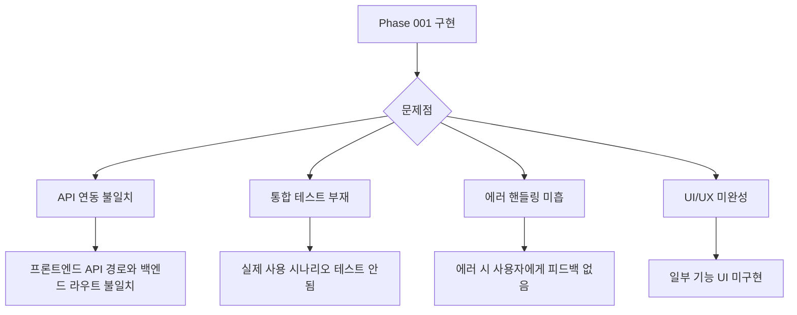
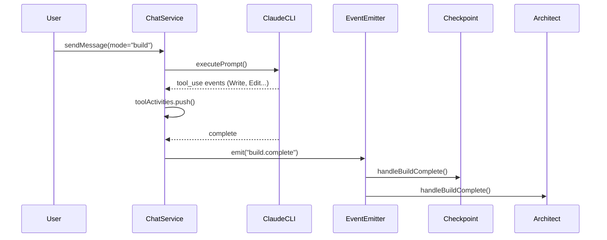
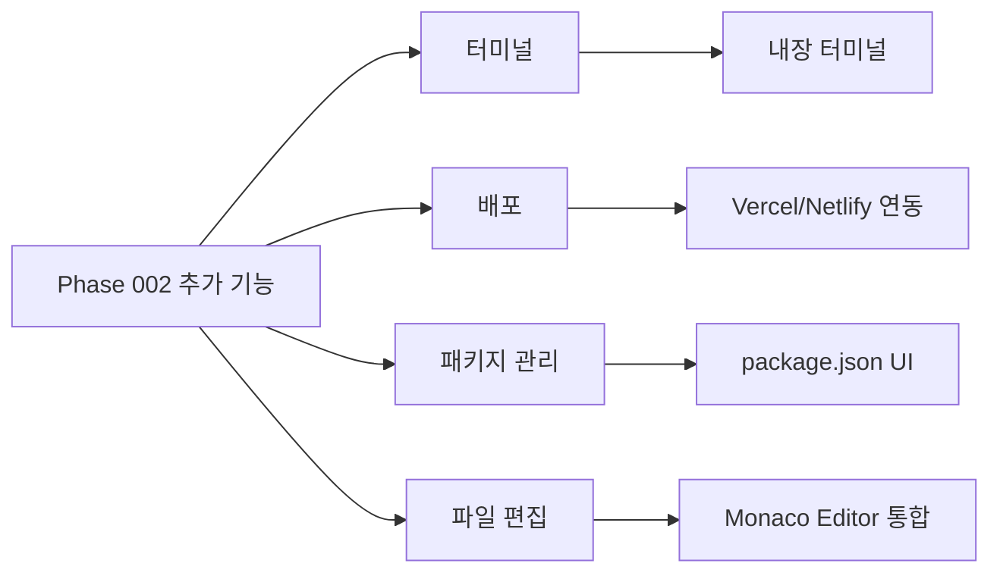

# Phase 002: 기능 고도화 Overview

> 작성일: 2025-12-30
> 상태: 진행 중

---

## 1. Phase 002 목표

Phase 001에서 구현된 기능들이 **실제로 동작하지 않거나 불완전한 상태**입니다. Phase 002의 목표는:

1. **기존 기능 정상화** - 구현되었지만 동작하지 않는 기능들 수정
2. **기능 고도화** - 기본 구현에서 실용적인 수준으로 개선
3. **추가 기능 식별** - 리플릿 등 유사 서비스 대비 누락된 기능 파악

---

## 2. 현재 상황 분석

### 2.1 API 테스트 결과 (2025-01-xx)

| 기능 | 백엔드 | 프론트엔드 | API 상태 | 실사용 상태 | 문제점 |
|------|--------|-----------|----------|------------|--------|
| **Checkpoint** | ✅ 있음 | ✅ 있음 | ✅ 응답함 | ❌ 미동작 | 체크포인트 기록이 안됨 |
| **Architect (Review)** | ✅ 있음 | ✅ 있음 | ✅ 응답함 | ⚠️ 불확실 | 리뷰 결과 반영 확인 필요 |
| **Database Viewer** | ✅ 있음 | ✅ 있음 | ❌ 500에러 | ❌ 미동작 | DB 없는 프로젝트 에러 처리 미흡 |
| **Testing (E2E)** | ✅ 있음 | ✅ 있음 | ✅ 응답함 | ⚠️ 미확인 | 실제 테스트 실행 필요 |
| **Env Manager** | ✅ 있음 | ✅ 있음 | ✅ 응답함 | ⚠️ 미확인 | UI 동작 확인 필요 |
| **Project Context** | ✅ 있음 | ❌ 없음 | ✅ 응답함 | ❌ 미동작 | UI 없음 |

#### API 테스트 상세 결과

```bash
# Checkpoint - API 응답하지만 실제 기록 안됨
GET /api/projects/:id/checkpoint → [] (빈 배열)
GET /api/projects/:id/checkpoint/status → {"hasChanges":false,"files":[]}

# Architect Review - API 응답
GET /api/projects/:id/architect/reviews → 리뷰 목록 반환

# Database Viewer - 500 에러
GET /api/projects/:id/database/tables → {"statusCode":500,"message":"Internal server error"}

# Testing (E2E) - API 응답
GET /api/projects/:id/testing/scenarios → [] (빈 배열)

# Env Manager - API 응답
GET /api/projects/:id/env → .env 파일 목록 및 변수 반환

# Project Context - API 응답
GET /api/projects/:id/context/exists → {"exists":false,"content":null}
```

### 2.2 공통 문제점



### 2.3 기능별 상세 분석

#### Checkpoint (체크포인트)
- **백엔드**: `apps/server/src/checkpoint/`
- **프론트엔드**: `CheckpointPanel.tsx`
- **확인된 문제**:
  - ❌ **체크포인트 기록이 실제로 생성되지 않음**
  - 빈 배열만 반환됨 - 저장 로직 또는 트리거 확인 필요
  - 수동 저장 버튼 동작 확인 필요

#### Architect (코드 리뷰)
- **백엔드**: `apps/server/src/architect/`
- **프론트엔드**: `ArchitectPanel.tsx`
- **확인된 문제**:
  - ⚠️ **리뷰 결과가 실제로 반영되는지 불확실**
  - API는 응답하지만 리뷰 트리거 및 결과 반영 확인 필요
  - Claude CLI 연동 상태 확인 필요

#### Database Viewer (DB 뷰어)
- **백엔드**: `apps/server/src/database/`
- **프론트엔드**: `DatabasePanel.tsx`
- **확인된 문제**:
  - ❌ **500 Internal Server Error 발생**
  - DB가 없는 프로젝트에서 적절한 에러 메시지 대신 500 에러 반환
  - NotFoundException 처리가 제대로 안 됨

#### Testing (E2E 테스팅)
- **백엔드**: `apps/server/src/testing/`
- **프론트엔드**: `TestRunner.tsx`
- **확인된 문제**:
  - ⚠️ **API는 응답하지만 실제 테스트 실행 확인 필요**
  - Playwright 의존성 및 설치 상태 확인 필요
  - 시나리오 저장이 메모리 기반인지 DB 기반인지 확인 필요

#### Env Manager (환경변수)
- **백엔드**: `apps/server/src/env/`
- **프론트엔드**: `EnvPanel.tsx`
- **확인된 문제**:
  - ✅ **API 정상 동작 확인**
  - .env 파일 목록 및 변수 반환됨
  - UI 연동 상태 추가 확인 필요

#### Project Context (프로젝트 컨텍스트)
- **백엔드**: `apps/server/src/project-context/`
- **프론트엔드**: ❌ 없음
- **확인된 문제**:
  - ✅ **API 정상 동작** (`exists: false` 적절히 반환)
  - ❌ **UI가 전혀 없음** - 백엔드만 있음

---

## 2.4 핵심 이벤트 분석

### build.complete 이벤트

체크포인트와 코드리뷰 기능은 모두 `build.complete` 이벤트에 의존합니다:



**발생 조건**:
- `mode === "build"` (기본값)
- `toolActivities.length > 0` (Write, Edit 등 도구 사용)

**문제 가능성**:
1. Claude CLI의 `tool_use` 이벤트가 파싱되지 않음
2. 프로젝트에 Git 초기화가 안됨
3. 이벤트 전달 과정에서 누락

---

## 3. Phase 002 작업 목록

### 3.1 우선순위 1: 핵심 기능 정상화

| 작업 | 설명 | 난이도 | 상태 |
|------|------|--------|------|
| **P2-001** | build.complete 이벤트 디버깅 | 고 | 대기 |
| **P2-002** | Database Viewer 500 에러 수정 | 저 | 대기 |
| **P2-003** | Checkpoint Git 초기화 로직 확인 | 중 | 대기 |
| **P2-004** | Architect Review 트리거 확인 | 중 | 대기 |

### 3.2 우선순위 2: 기능 완성

| 작업 | 설명 | 난이도 | 상태 |
|------|------|--------|------|
| **P2-005** | Project Context UI 구현 | 중 | 대기 |
| **P2-006** | Testing 기능 E2E 확인 | 중 | 대기 |
| **P2-007** | 에러 핸들링 개선 (500 → 적절한 HTTP 코드) | 중 | 대기 |

### 3.3 우선순위 3: 고도화

| 작업 | 설명 | 난이도 | 상태 |
|------|------|--------|------|
| **P2-008** | Checkpoint 자동 저장 | 중 | 대기 |
| **P2-009** | Database Viewer SQL 에디터 개선 | 중 | 대기 |
| **P2-010** | Review 결과 요약 대시보드 | 중 | 대기 |

---

## 4. 추가 기능 후보 (리플릿 참조)

### 4.1 리플릿 주요 기능 비교

| 리플릿 기능 | ClaudeShip 현황 | 우선순위 |
|------------|----------------|---------|
| **Deployment** | ❌ 없음 | 높음 |
| **Custom Domain** | ❌ 없음 | 중간 |
| **Secrets Management** | ⚠️ Env로 일부 대체 | 낮음 |
| **Multiplayer Editing** | ❌ 없음 | 낮음 |
| **AI Chat History** | ✅ 있음 | - |
| **File Editing** | ✅ 있음 (조회만) | 중간 |
| **Shell/Terminal** | ❌ 없음 | 높음 |
| **Package Manager UI** | ❌ 없음 | 중간 |
| **Preview URL Sharing** | ❌ 없음 | 중간 |

### 4.2 추가 기능 후보 목록



#### 높음 우선순위
1. **터미널** - 웹 기반 터미널 (xterm.js)
2. **배포** - Vercel/Netlify 원클릭 배포

#### 중간 우선순위
3. **파일 편집** - 파일 탐색기에서 직접 편집
4. **패키지 관리** - 의존성 추가/제거 UI

#### 낮음 우선순위
5. **Preview URL 공유** - 외부 접근 가능한 URL
6. **멀티플레이어** - 실시간 협업

---

## 5. Phase 002 로드맵

```mermaid
gantt
    title Phase 002 로드맵
    dateFormat X
    axisFormat %s

    section 1단계: 정상화
    Checkpoint 수정       :a1, 0, 2
    Database Viewer 수정  :a2, after a1, 2
    Env Manager 수정      :a3, after a1, 1

    section 2단계: 완성
    Project Context UI    :b1, after a2, 2
    Architect Review 수정 :b2, after a3, 3
    에러 핸들링 개선      :b3, after b1, 2

    section 3단계: 고도화
    자동 체크포인트       :c1, after b2, 2
    터미널 기능           :c2, after b3, 3
```



---

## 6. 다음 단계

1. **기능별 상세 분석 문서 작성** - 각 기능의 현재 문제점과 수정 방향
2. **테스트 시나리오 작성** - 기능별 정상 동작 확인 기준
3. **작업 착수** - 우선순위 순으로 수정 진행

---

## 7. 관련 문서

- [Phase 001 문서들](../phase-001/) - 기존 설계 문서
- 002-checkpoint-fix.md (예정) - 체크포인트 수정 상세
- 003-database-viewer-fix.md (예정) - DB 뷰어 수정 상세
