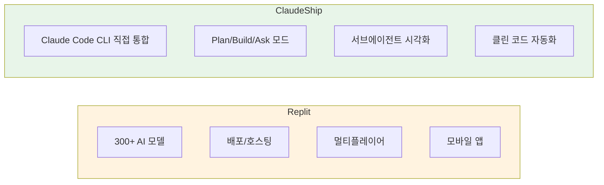
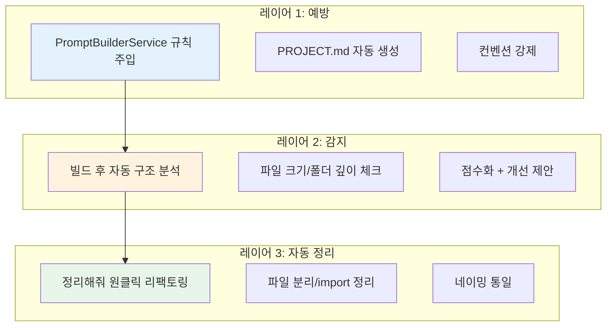
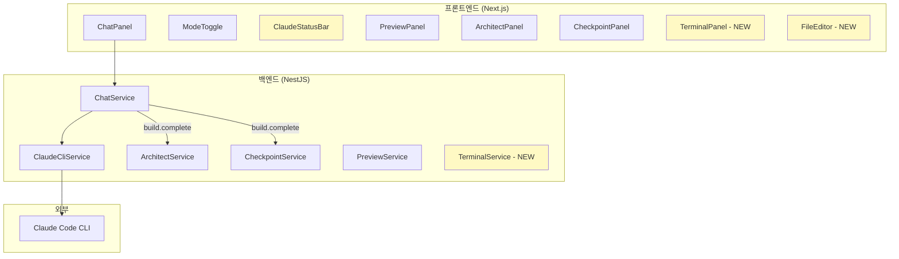
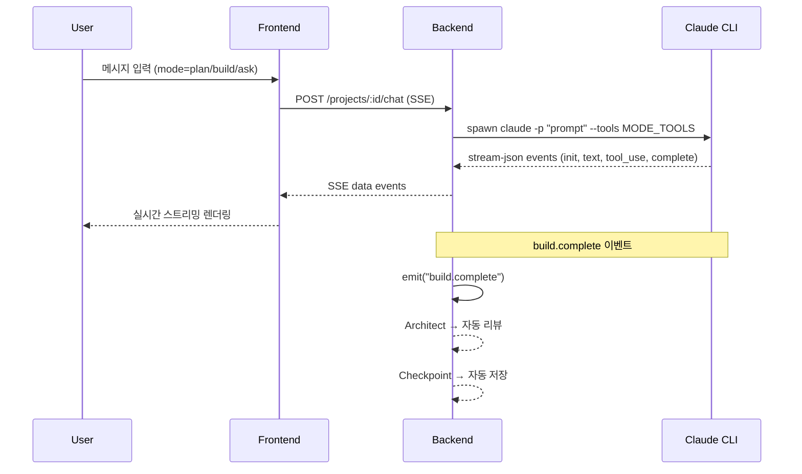

# Phase 002: Claude Code 모드 노출 및 개발 생산성 기능

> 작성일: 2026-02-17
> 상태: 구현 완료
> Issue: #94
> 브랜치: `feature/#94-phase002-claude-code-modes`

---

## 1. Phase 002 목표

Phase 001의 버그 수정(PR #84)이 완료된 후, Phase 002는 **신규 기능 개발**에 집중합니다.

### 핵심 전략
> **Claude Code CLI의 강력한 기능을 웹 UI로 노출 + 클린 코드 자동화**

Replit Agent 대비 ClaudeShip의 포지셔닝: **"Claude Code를 가장 잘 활용하는 웹 IDE"**

### 왜 이 전략인가?

```mermaid
flowchart LR
    subgraph Replit
        R1[300+ AI 모델]
        R2[배포/호스팅]
        R3[멀티플레이어]
        R4[모바일 앱]
    end

    subgraph ClaudeShip
        C1[Claude Code CLI 직접 통합]
        C2[Plan/Build/Ask 모드]
        C3[서브에이전트 시각화]
        C4[클린 코드 자동화]
    end

    style ClaudeShip fill:#e8f5e9
    style Replit fill:#fff3e0
```

- Replit은 범용 클라우드 IDE → 전체 인프라/모델 경쟁에서 이기기 어려움
- ClaudeShip은 Claude Code CLI를 **백엔드 엔진**으로 직접 사용 → CLI의 모든 기능을 웹에서 활용
- Replit의 약점(지저분한 코드 생성)을 클린 코드 전략으로 차별화

---

## 2. Phase 001 버그 수정 현황

> PR #84에서 해결 완료

| 작업 | 설명 | 상태 |
|------|------|------|
| P2-001 | build.complete 이벤트 디버깅 | ✅ 완료 |
| P2-002 | Database Viewer 500 에러 수정 | ✅ 완료 |
| P2-003 | Checkpoint Git 초기화 로직 수정 | ✅ 완료 |
| P2-004 | Architect Review 트리거 수정 | ✅ 완료 |
| P2-005 | Project Context UI 구현 | ✅ 완료 |
| P2-006~010 | 기타 버그 수정 및 고도화 | ✅ 완료 |

---

## 3. Phase 002 신규 기능 목록

### 3.1 1단계: Claude Code 모드 노출 (핵심)

| ID | 기능 | 설명 | 설계 문서 |
|----|------|------|-----------|
| P2-011 | Plan Mode 지원 | Plan/Build/Ask 3단 모드 토글 | [002-feature-gap-analysis.md](./002-feature-gap-analysis.md) |
| P2-012 | 상태 대시보드 | 세션, 도구, 토큰, 비용 실시간 표시 | [003-claude-mode-features.md](./003-claude-mode-features.md) |
| P2-013 | 도구 시각화 개선 | 카테고리별 색상, 요약 배지, 통계 | [003-claude-mode-features.md](./003-claude-mode-features.md) |

### 3.2 2단계: 개발 생산성

| ID | 기능 | 설명 | 설계 문서 |
|----|------|------|-----------|
| P2-014 | 웹 터미널 | xterm.js + node-pty | [004-dev-productivity.md](./004-dev-productivity.md) |
| P2-015 | 파일 편집기 | Monaco/CodeMirror 통합 | [004-dev-productivity.md](./004-dev-productivity.md) |
| P2-022 | 에러→AI 자동수정 | 에러 감지→채팅 전달→수정 | [004-dev-productivity.md](./004-dev-productivity.md) |

### 3.3 3단계: AI 에이전트 고도화

| ID | 기능 | 설명 | 설계 문서 |
|----|------|------|-----------|
| P2-017 | Architect 고도화 | 보안 스캔, 코드 구조 분석, Fix with Agent | [005-agent-enhancement.md](./005-agent-enhancement.md) |
| P2-018 | 서브에이전트 UI | 활성 에이전트 목록, 진행 상태, 결과 요약 | [005-agent-enhancement.md](./005-agent-enhancement.md) |
| P2-019 | 커스텀 에이전트 관리 | .claude/agents/ YAML 관리 UI | [005-agent-enhancement.md](./005-agent-enhancement.md) |

### 3.4 4단계: 완성도

| ID | 기능 | 설명 | 설계 문서 |
|----|------|------|-----------|
| P2-020 | 체크포인트 개선 | 시각적 타임라인, 미리보기 | [006-polish-features.md](./006-polish-features.md) |
| P2-021 | 설정 마법사 | 템플릿, AI 추천, 보일러플레이트 | [006-polish-features.md](./006-polish-features.md) |

### 제외
- ~~P2-016: 배포 기능 (Vercel/Netlify)~~ — 스코프 제외

---

## 4. 클린 코드 전략 (Replit 차별화)

Replit Agent의 문제: **코드 구조가 지저분함** (God component, 중복 코드, flat 구조)

```mermaid
flowchart TB
    subgraph "레이어 1: 예방"
        P1[PromptBuilderService 규칙 주입]
        P2[PROJECT.md 자동 생성]
        P3[컨벤션 강제]
    end

    subgraph "레이어 2: 감지"
        D1[빌드 후 자동 구조 분석]
        D2[파일 크기/폴더 깊이 체크]
        D3[점수화 + 개선 제안]
    end

    subgraph "레이어 3: 자동 정리"
        R1["정리해줘" 원클릭 리팩토링]
        R2[파일 분리/import 정리]
        R3[네이밍 통일]
    end

    P1 --> D1
    D1 --> R1

    style P1 fill:#e3f2fd
    style D1 fill:#fff3e0
    style R1 fill:#e8f5e9
```

| 레이어 | 적용 기능 |
|--------|-----------|
| 예방 (프롬프트) | P2-011, P2-021 |
| 감지 (Architect) | P2-017 |
| 자동 정리 (리팩토링) | P2-017, P2-019 |

---

## 5. 아키텍처 개요

### 현재 시스템 구조

```mermaid
flowchart TB
    subgraph Frontend["프론트엔드 (Next.js)"]
        Chat[ChatPanel]
        ModeToggle[ModeToggle]
        StatusBar[ClaudeStatusBar]
        Preview[PreviewPanel]
        Architect[ArchitectPanel]
        Checkpoint[CheckpointPanel]
        Terminal[TerminalPanel - NEW]
        Editor[FileEditor - NEW]
    end

    subgraph Backend["백엔드 (NestJS)"]
        ChatSvc[ChatService]
        ClaudeCLI[ClaudeCliService]
        ArchSvc[ArchitectService]
        CheckSvc[CheckpointService]
        PreviewSvc[PreviewService]
        TermSvc[TerminalService - NEW]
    end

    subgraph External["외부"]
        Claude[Claude Code CLI]
    end

    Chat --> ChatSvc
    ChatSvc --> ClaudeCLI
    ClaudeCLI --> Claude
    ChatSvc --"build.complete"--> ArchSvc
    ChatSvc --"build.complete"--> CheckSvc

    style Terminal fill:#fff9c4
    style Editor fill:#fff9c4
    style TermSvc fill:#fff9c4
    style StatusBar fill:#fff9c4
```

### 데이터 흐름 (SSE 기반)

```mermaid
sequenceDiagram
    participant User
    participant Web as Frontend
    participant API as Backend
    participant CLI as Claude CLI

    User->>Web: 메시지 입력 (mode=plan/build/ask)
    Web->>API: POST /projects/:id/chat (SSE)
    API->>CLI: spawn claude -p "prompt" --tools MODE_TOOLS
    CLI-->>API: stream-json events (init, text, tool_use, complete)
    API-->>Web: SSE data events
    Web-->>User: 실시간 스트리밍 렌더링

    Note over API,CLI: build.complete 이벤트
    API->>API: emit("build.complete")
    API-->>API: Architect → 자동 리뷰
    API-->>API: Checkpoint → 자동 저장
```

---

## 6. 관련 문서

- [Phase 001 문서들](../phase-001/) - MVP 설계 문서
- [002-feature-gap-analysis.md](./002-feature-gap-analysis.md) - Replit/Claude Code 비교 분석
- [003-claude-mode-features.md](./003-claude-mode-features.md) - 1단계 기능 상세 설계
- [004-dev-productivity.md](./004-dev-productivity.md) - 2단계 기능 상세 설계
- [005-agent-enhancement.md](./005-agent-enhancement.md) - 3단계 기능 상세 설계
- [006-polish-features.md](./006-polish-features.md) - 4단계 기능 상세 설계
