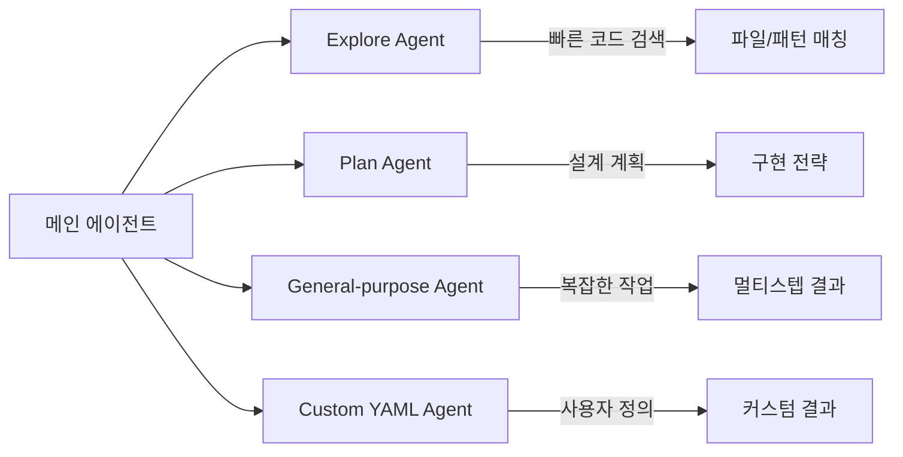
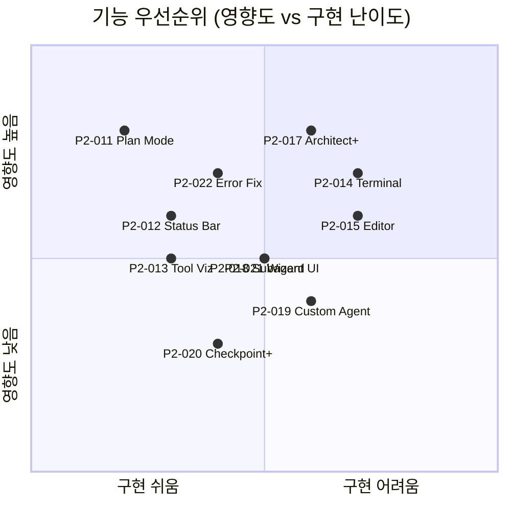

# Phase 002: 기능 갭 분석 - Replit vs Claude Code vs ClaudeShip

> 작성일: 2026-02-17
> 목적: 경쟁 서비스 분석 및 ClaudeShip 차별화 기능 도출

---

## 1. Replit Agent 주요 기능

### 1.1 Agent 3 모드

| 모드 | 설명 |
|------|------|
| **Plan** | 구현 전 계획 수립, 사용자 확인 후 실행 |
| **Build** | 전체 앱 빌드 (풀스택) |
| **Edit** | 기존 코드 수정/개선 |
| **Design** | Figma import 지원 |
| **Fast Build** | 빠른 프로토타이핑 |

### 1.2 개발 인프라

| 기능 | 설명 |
|------|------|
| 배포 | 원클릭 배포, 커스텀 도메인 |
| 터미널 | 내장 Shell |
| 파일 편집 | Monaco Editor 통합 |
| 패키지 관리 | UI 기반 의존성 관리 |
| 멀티플레이어 | 실시간 협업 |
| 모바일 앱 | iOS/Android 앱 |
| AI 모델 | 300+ 모델 지원 |
| 보안 스캔 | 자동 코드 보안 분석 |

### 1.3 Replit의 약점

- **코드 품질**: God component, 중복 코드, flat 구조
- **폴더 구조**: 기능별 분리 없이 단일 디렉토리
- **네이밍**: 일관성 없는 변수/파일명
- **리팩토링**: 코드가 커지면 구조 개선 불가

---

## 2. Claude Code CLI 주요 기능

### 2.1 실행 모드

| 모드 | CLI 플래그 | 도구 제한 |
|------|-----------|----------|
| **Normal** | (기본) | 모든 도구 |
| **Plan** | `--tools "Read,Glob,Grep,..."` | 읽기 전용 + Task, TodoWrite |
| **Auto-accept** | `--dangerously-skip-permissions` | 권한 자동 수락 |

### 2.2 서브에이전트 시스템

| 에이전트 | 용도 |
|---------|------|
| Explore | 코드베이스 빠른 탐색 |
| Plan | 구현 전략 설계 |
| General-purpose | 복잡한 멀티스텝 작업 |
| Custom (YAML) | `.claude/agents/*.yml` 사용자 정의 에이전트 |

### 2.3 기타 기능

- **Hooks**: PreToolUse, PostToolUse, SubagentStart/Stop 라이프사이클
- **MCP 서버**: 외부 도구 통합
- **Persistent Memory**: `.claude/` 폴더 기반 메모리
- **Agent SDK**: 커스텀 에이전트 빌드 프레임워크
- **Stream JSON**: `--output-format stream-json` 실시간 이벤트

---

## 3. ClaudeShip 현재 기능 맵

### 3.1 구현 완료

| 영역 | 기능 | 상태 |
|------|------|------|
| 채팅 | Ask/Build 2단 모드 | ✅ |
| 채팅 | SSE 스트리밍 | ✅ |
| 채팅 | 메시지 큐잉 | ✅ |
| 채팅 | AskUserQuestion 지원 | ✅ |
| 채팅 | 파일 첨부 | ✅ |
| 프리뷰 | 자동 시작/중지 | ✅ |
| 프리뷰 | 디바이스 프리셋 | ✅ |
| 프리뷰 | 에러 오버레이 | ✅ |
| 프리뷰 | 콘솔 로그 뷰어 | ✅ |
| 파일 | 파일 탐색기 | ✅ |
| 파일 | 파일 뷰어 (읽기 전용) | ✅ |
| 체크포인트 | Git 기반 자동 저장 | ✅ |
| 체크포인트 | diff 뷰어 | ✅ |
| 리뷰 | 코드 리뷰 (Architect) | ✅ |
| 리뷰 | 자동 수정 (Auto-fix) | ✅ |
| DB | Database Viewer | ✅ |
| 테스트 | E2E 테스트 러너 | ✅ |
| 환경 | 환경변수 관리 | ✅ |
| 컨텍스트 | 프로젝트 컨텍스트 관리 | ✅ |

### 3.2 미구현 (Phase 002 대상)

| 영역 | 기능 | Replit | Claude Code |
|------|------|-------|-------------|
| 모드 | Plan Mode | ✅ | ✅ |
| 상태 | 세션/비용 대시보드 | ❌ | CLI 출력 |
| 시각화 | 도구 카테고리별 색상 | ❌ | ❌ |
| 터미널 | 내장 터미널 | ✅ | CLI 자체 |
| 편집 | 코드 편집기 | ✅ | ❌ |
| 에러 | AI 자동수정 | ✅ | ❌ |
| 에이전트 | 서브에이전트 시각화 | ❌ | CLI 로그 |
| 에이전트 | 커스텀 에이전트 관리 | ❌ | YAML 직접 편집 |
| 보안 | 코드 보안 스캔 | ✅ | ❌ |
| 마법사 | 프로젝트 설정 | ✅ | ❌ |

---

## 4. 기능 우선순위 매트릭스

---

## 5. 구현 로드맵

```mermaid
gantt
    title Phase 002 구현 로드맵
    dateFormat X
    axisFormat %s

    section 1단계: 모드 노출
    P2-011 Plan Mode      :done, a1, 0, 1
    P2-012 Status Bar     :done, a2, 0, 1
    P2-013 Tool Viz       :done, a3, 0, 1

    section 2단계: 생산성
    P2-022 Error→AI Fix   :done, b1, 1, 2
    P2-014 Web Terminal   :b2, 2, 4
    P2-015 File Editor    :b3, 2, 4

    section 3단계: 에이전트
    P2-017 Architect+     :c1, 4, 6
    P2-018 Subagent UI    :c2, 4, 6
    P2-019 Custom Agent   :c3, 5, 7

    section 4단계: 완성도
    P2-020 Checkpoint+    :d1, 7, 8
    P2-021 Setup Wizard   :d2, 7, 9
```

