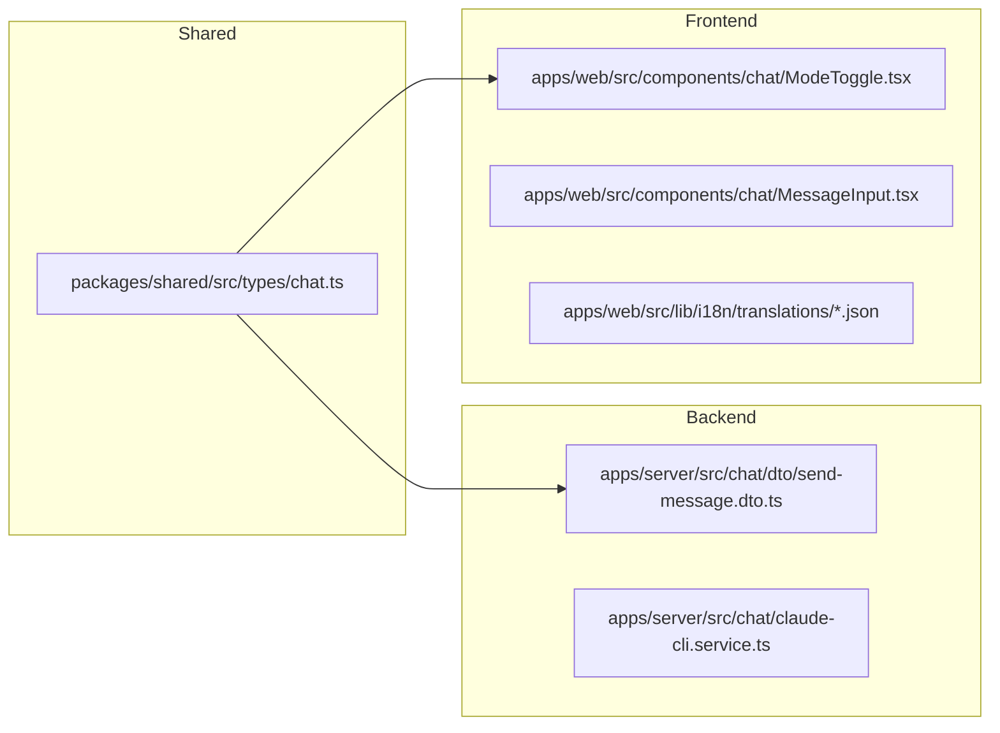
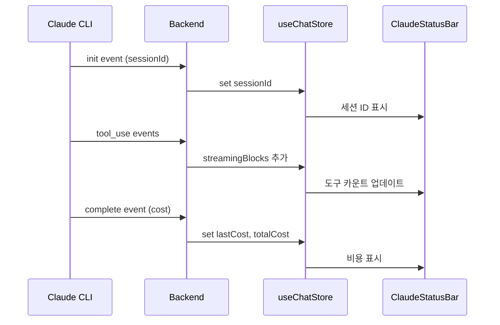

# 1단계: Claude Code 모드 노출 기능 설계

> P2-011, P2-012, P2-013
> 상태: 구현 완료

---

## 1. P2-011: Plan Mode 지원

### 1.1 개요

Claude Code CLI의 3가지 모드(Ask/Plan/Build)를 웹 UI에서 모두 지원합니다.

### 1.2 모드 정의

| 모드 | 용도 | 허용 도구 | UI 색상 |
|------|------|----------|---------|
| **Ask** | 질문/조회 | Read, Glob, Grep, LSP, WebFetch, WebSearch | 파랑 (`blue-500`) |
| **Plan** | 구현 계획 수립 | Ask 도구 + Task, TodoWrite | 보라 (`violet-500`) |
| **Build** | 실제 구현 | 모든 도구 | 초록 (`green-500`) |

### 1.3 변경 파일



### 1.4 구현 상세

#### 타입 변경
```typescript
// packages/shared/src/types/chat.ts
export type ChatMode = "ask" | "build" | "plan";  // "plan" 추가
```

#### CLI 도구 제한
```typescript
// claude-cli.service.ts
const ASK_MODE_TOOLS = ["Read", "Glob", "Grep", "LSP", "WebFetch", "WebSearch"];
const PLAN_MODE_TOOLS = ["Read", "Glob", "Grep", "LSP", "WebFetch", "WebSearch", "Task", "TodoWrite"];
// Build 모드: 도구 제한 없음
```

#### UI 토글
- 3버튼 토글: Ask (파랑) → Plan (보라) → Build (초록)
- 스트리밍 중 비활성화
- 모드별 placeholder 텍스트 변경

---

## 2. P2-012: Claude Code 상태 대시보드

### 2.1 개요

채팅 패널 헤더 아래에 컴팩트한 상태 바를 추가하여 현재 세션 정보를 실시간 표시합니다.

### 2.2 표시 정보

| 항목 | 소스 | 표시 조건 |
|------|------|----------|
| 현재 모드 | `useChatStore.mode` | 항상 |
| 활성 상태 | `useChatStore.isStreaming` | 스트리밍 중 |
| 경과 시간 | `streamStartedAt` → 계산 | 스트리밍 중 |
| 도구 사용 수 | `streamingBlocks` 카운트 | 도구 사용 시 |
| 비용 | SSE `complete` 이벤트 | 완료 후 |

### 2.3 컴포넌트 구조

```
ClaudeStatusBar
├── Mode Indicator (모드 배지 + 아이콘)
├── Activity Status (Active 표시 + 애니메이션)
├── Duration Timer (경과 시간)
├── Tool Count (도구 사용 수 + 실행 중 수)
└── Cost Display (마지막/총 비용)
```

### 2.4 Store 확장

```typescript
// useChatStore에 추가된 상태
interface ChatState {
  // ... 기존 상태
  sessionId: string | null;      // init 이벤트에서 추출
  lastCost: number | null;       // 마지막 응답 비용
  totalCost: number;             // 세션 총 비용
  streamStartedAt: number | null; // 타이머용
}
```

### 2.5 SSE 이벤트 처리



---

## 3. P2-013: 도구 사용 시각화 개선

### 3.1 개요

도구 사용을 카테고리별로 색상 구분하고, 도구 그룹에 요약 배지를 표시합니다.

### 3.2 도구 카테고리

| 카테고리 | 도구 | 색상 |
|---------|------|------|
| **File** | Read, Edit, Write | 파랑 (`blue`) |
| **Search** | Glob, Grep | 보라 (`purple`) |
| **System** | Bash | 주황 (`orange`) |
| **Web** | WebFetch, WebSearch | 에메랄드 (`emerald`) |
| **Agent** | Task, TodoWrite | 바이올렛 (`violet`) |

### 3.3 시각화 요소

#### 도구 블록 (ToolUseBlock)
- 실행 중: 해당 카테고리 색상 배경 + 스피너
- 완료: 회색 배경 + 체크 아이콘
- 실행 시간 표시 (`ms` 또는 `s`)

#### 요약 배지 (ToolSummaryBadges)
- 5개 이상 도구 그룹에 카테고리별 카운트 배지 표시
- 예: `[File 3] [Search 2] [System 1] (4.2s)`
- 접기/펼치기 기능 유지

### 3.4 렌더링 구조

```
StreamingMessage
├── BlockGroup (consecutive tool_use)
│   ├── ToolSummaryBadges (≥5 tools)
│   │   ├── [File 3]
│   │   ├── [Search 2]
│   │   └── (total duration)
│   ├── ToolUseBlock (카테고리 색상)
│   ├── ToolUseBlock
│   ├── [N개 더 보기] (collapse)
│   └── ToolUseBlock
├── TextBlock (markdown)
└── AskUserQuestionBlock
```
