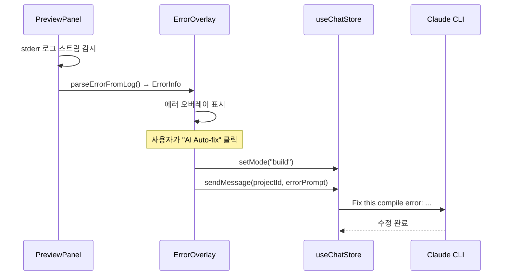
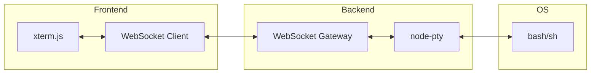
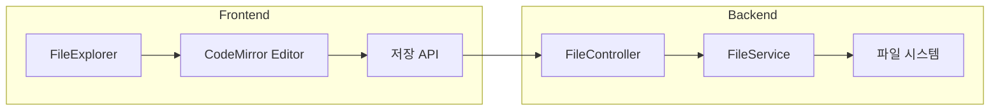

# 2단계: 개발 생산성 기능 설계

> P2-014, P2-015, P2-022
> 상태: 구현 완료

---

## 1. P2-022: 에러 → AI 자동 수정 연결

### 1.1 개요

프리뷰 패널에서 감지된 에러를 한 번의 클릭으로 AI에게 전달하여 자동 수정합니다.

### 1.2 흐름



### 1.3 구현 상세

#### ErrorOverlay 확장
- `projectId` prop 추가
- "AI Auto-fix" 버튼 (`Wand2` 아이콘, 보라색)
- 클릭 시: mode를 build로 변경 → 에러 정보를 프롬프트로 전송 → 오버레이 닫기

#### 프롬프트 구성
```
Fix this {error.type} error:
{error.message}
File: {error.location.file}:{error.location.line}:{error.location.column}

Stack trace:
{error.stack}
```

### 1.4 변경 파일
- `apps/web/src/components/preview/ErrorOverlay.tsx` - AI Auto-fix 버튼 추가
- `apps/web/src/components/preview/PreviewPanel.tsx` - projectId 전달

---

## 2. P2-014: 웹 터미널

### 2.1 개요

xterm.js + node-pty를 사용한 내장 웹 터미널. 사용자가 프로젝트 디렉토리에서 직접 명령어를 실행할 수 있습니다.

### 2.2 아키텍처



### 2.3 프론트엔드

#### 컴포넌트: `TerminalPanel`
- xterm.js 기반 터미널 에뮬레이터
- WebSocket으로 백엔드 PTY와 연결
- 워크스페이스 탭에 "Terminal" 탭 추가

#### 의존성
```
@xterm/xterm
@xterm/addon-fit
@xterm/addon-web-links
```

### 2.4 백엔드

#### 모듈: `TerminalModule`
- `TerminalGateway` (WebSocket): 터미널 I/O 중계
- `TerminalService`: node-pty 프로세스 관리

#### 의존성
```
node-pty
```

#### WebSocket 이벤트

| 이벤트 | 방향 | 설명 |
|--------|------|------|
| `terminal:start` | Client → Server | 터미널 시작 (projectId) |
| `terminal:input` | Client → Server | 사용자 입력 |
| `terminal:output` | Server → Client | PTY 출력 |
| `terminal:resize` | Client → Server | 창 크기 변경 |
| `terminal:exit` | Server → Client | 프로세스 종료 |

### 2.5 UI 배치

```
WorkspaceLayout 탭 바:
[Preview] [Database] [Testing] [Review] [Checkpoint] [Env] [Context] [Terminal]
                                                                       ^^^^^^^^ NEW
```

---

## 3. P2-015: 파일 편집기

### 3.1 개요

현재 읽기 전용인 FileViewer를 CodeMirror 기반 편집기로 업그레이드합니다.

### 3.2 아키텍처



### 3.3 프론트엔드

#### 컴포넌트: `FileEditor`
- CodeMirror 6 기반 (가벼움, 모바일 지원)
- 언어별 구문 강조 (TypeScript, Python, JSON, CSS, HTML 등)
- 키바인딩: `Ctrl+S` 저장
- 변경 표시 (dot indicator)

#### 의존성
```
@codemirror/state
@codemirror/view
@codemirror/lang-javascript
@codemirror/lang-python
@codemirror/lang-json
@codemirror/lang-css
@codemirror/lang-html
@codemirror/theme-one-dark
```

### 3.4 백엔드

#### FileController 확장
```
PUT /projects/:projectId/files/content
Body: { path: string, content: string }
```

#### 보안
- 경로 검증 (디렉토리 트래버설 방지)
- 프로젝트 루트 외부 접근 차단
- 바이너리 파일 편집 차단

### 3.5 FileExplorer 연동

현재 FileViewer(모달)를 FileEditor로 교체:
- 클릭 시 편집 모드로 열림
- 저장 시 파일 시스템에 직접 쓰기
- 저장 후 프리뷰 자동 새로고침
