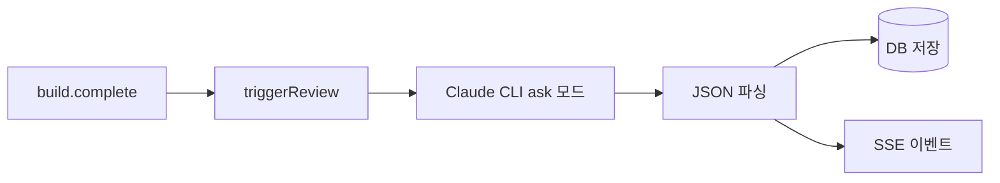
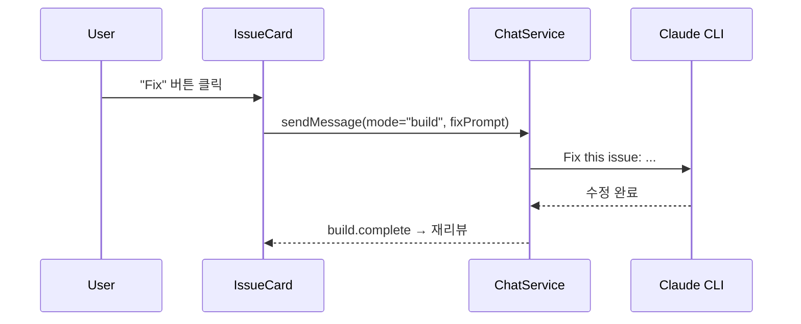

# 3단계: AI 에이전트 고도화 설계

> P2-017, P2-018, P2-019
> 상태: 구현 완료

---

## 1. P2-017: Architect Agent 고도화

### 1.1 개요

기존 코드 리뷰 기능에 보안 스캔, 코드 구조 분석, "Fix with Agent" 기능을 추가합니다.

### 1.2 현재 구조



현재 리뷰 카테고리: `security`, `bug`, `architecture`, `performance`, `quality`

### 1.3 추가 기능

#### A. 보안 스캔 (OWASP Top 10)

리뷰 프롬프트에 보안 체크리스트 추가:

| OWASP 항목 | 체크 내용 |
|-----------|----------|
| A01: Broken Access Control | 인증/인가 누락 확인 |
| A02: Cryptographic Failures | 하드코딩된 시크릿 |
| A03: Injection | SQL/Command/XSS Injection |
| A07: Auth Failures | 약한 비밀번호 정책 |
| A09: Logging Failures | 민감 정보 로그 출력 |

구현: `ArchitectService`의 리뷰 프롬프트에 보안 검사 섹션 추가.

#### B. 코드 구조 분석

Architect 프롬프트에 구조 분석 항목 추가:

| 분석 항목 | 기준 |
|----------|------|
| 파일 크기 | 300줄 초과 시 경고 |
| 폴더 깊이 | 5단계 이상 경고 |
| God Component | 하나의 컴포넌트에 너무 많은 로직 |
| 중복 코드 | 유사 패턴 반복 감지 |
| 네이밍 일관성 | camelCase/PascalCase 혼용 |
| 미사용 코드 | import 되었지만 사용되지 않는 모듈 |

결과를 기존 `ReviewIssue`의 `category: "architecture"` 또는 `"quality"`로 분류.

#### C. Fix with Agent



- IssueCard에 "Fix" 버튼 추가 (`autoFixable === true`일 때)
- 클릭 시 이슈 정보를 프롬프트로 구성하여 채팅에 전달
- 수정 후 자동 재리뷰 트리거

### 1.4 변경 파일

| 파일 | 변경 내용 |
|------|----------|
| `architect.service.ts` | 리뷰 프롬프트에 보안/구조 분석 추가 |
| `IssueCard.tsx` | "Fix" 버튼 추가 |
| `ArchitectPanel.tsx` | 카테고리 필터 추가 |

---

## 2. P2-018: 서브에이전트 실행 UI

### 2.1 개요

Claude Code CLI가 실행하는 서브에이전트(Task 도구)의 진행 상태를 시각적으로 표시합니다.

### 2.2 서브에이전트 이벤트 감지

Claude CLI의 stream-json에서 `Task` 도구 사용 감지:

```json
{
  "type": "assistant",
  "message": {
    "content": [{
      "type": "tool_use",
      "name": "Task",
      "input": {
        "description": "Explore codebase",
        "prompt": "Find all API endpoints...",
        "subagent_type": "Explore"
      }
    }]
  }
}
```

### 2.3 UI 컴포넌트

#### SubagentBlock (StreamingMessage 내부)

```
┌─────────────────────────────────────────────┐
│ 🤖 Explore Agent: "Explore codebase"        │
│ ├─ 상태: 실행 중... (12s)                    │
│ └─ [결과 보기]                               │
└─────────────────────────────────────────────┘
```

- `Task` 도구를 특별한 블록으로 렌더링
- 에이전트 타입 표시 (Explore, Plan, General-purpose)
- 실행 시간 추적
- 결과가 있으면 접기/펼치기로 표시

### 2.4 구현 방식

기존 `ToolUseBlock`에서 `Task` 도구일 때 확장된 UI를 렌더링:

```typescript
// StreamingMessage.tsx
if (toolName === "Task") {
  return <SubagentBlock block={block} />;
}
```

### 2.5 변경 파일

| 파일 | 변경 내용 |
|------|----------|
| `StreamingMessage.tsx` | Task 도구 특별 렌더링 |
| `SubagentBlock.tsx` | 신규 컴포넌트 |

---

## 3. P2-019: 커스텀 에이전트 관리 UI

### 3.1 개요

`.claude/agents/` 디렉토리의 YAML 에이전트 파일을 웹 UI에서 관리합니다.

### 3.2 YAML 에이전트 구조

```yaml
# .claude/agents/code-reviewer.yml
name: Code Reviewer
description: Reviews code for best practices
tools:
  - Read
  - Glob
  - Grep
prompt: |
  You are a code reviewer. Analyze the codebase and provide feedback.
```

### 3.3 UI 설계

```
┌─ Custom Agents ─────────────────────────────┐
│                                              │
│ ┌──────────────────────────────────────────┐ │
│ │ 🤖 Code Reviewer                        │ │
│ │ Reviews code for best practices          │ │
│ │ Tools: Read, Glob, Grep                  │ │
│ │ [실행] [편집] [삭제]                      │ │
│ └──────────────────────────────────────────┘ │
│                                              │
│ ┌──────────────────────────────────────────┐ │
│ │ 🤖 Security Auditor                     │ │
│ │ Scans for security vulnerabilities       │ │
│ │ Tools: Read, Glob, Grep, WebSearch       │ │
│ │ [실행] [편집] [삭제]                      │ │
│ └──────────────────────────────────────────┘ │
│                                              │
│ [+ 새 에이전트 생성]                          │
└──────────────────────────────────────────────┘
```

### 3.4 백엔드 API

```
GET    /projects/:id/agents           → 에이전트 목록
GET    /projects/:id/agents/:name     → 에이전트 상세
POST   /projects/:id/agents           → 에이전트 생성
PUT    /projects/:id/agents/:name     → 에이전트 수정
DELETE /projects/:id/agents/:name     → 에이전트 삭제
POST   /projects/:id/agents/:name/run → 에이전트 실행
```

### 3.5 변경 파일

| 파일 | 변경 내용 |
|------|----------|
| `AgentModule` (NEW) | 백엔드 모듈 |
| `AgentService` (NEW) | YAML 파일 CRUD |
| `AgentController` (NEW) | REST API |
| `AgentPanel.tsx` (NEW) | 프론트엔드 관리 UI |
| `WorkspaceLayout.tsx` | "Agents" 탭 추가 |
