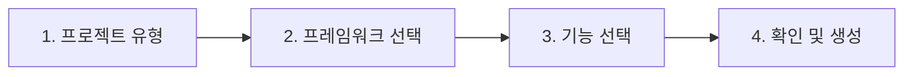

# 4단계: 완성도 기능 설계

> P2-020, P2-021
> 상태: 구현 완료

---

## 1. P2-020: 체크포인트 타임라인 개선

### 1.1 개요

현재 리스트 형태의 체크포인트를 시각적 타임라인으로 개선하고, 미리보기 기능을 추가합니다.

### 1.2 현재 vs 개선

| 항목 | 현재 | 개선 |
|------|------|------|
| 레이아웃 | 단순 리스트 | 수직 타임라인 (점+선) |
| 정보 | 메시지, 시간 | + 파일 수, 추가/삭제 라인 수, diff 요약 |
| 인터랙션 | 클릭→diff | + 호버 미리보기, 복원 확인 다이얼로그 개선 |
| 시각 | 텍스트 | + 변경량 막대 그래프 |

### 1.3 타임라인 UI

```
  ●─── Auto checkpoint at 14:32:05
  │    📄 3 files changed (+45, -12)
  │    ▓▓▓▓░░░░ (insertions vs deletions)
  │
  ●─── Auto checkpoint at 14:28:11
  │    📄 1 file changed (+8, -2)
  │    ▓░
  │
  ●─── Manual: Initial setup
  │    📄 5 files changed (+120, -0)
  │    ▓▓▓▓▓▓▓▓
  │
  ◯ (프로젝트 시작)
```

### 1.4 컴포넌트 구조

```
CheckpointPanel
├── CheckpointTimeline (수직 타임라인)
│   ├── TimelineNode (각 체크포인트)
│   │   ├── TimelineDot (● 또는 ◯)
│   │   ├── TimelineInfo (메시지, 시간, 파일 수)
│   │   └── ChangeBar (변경량 시각화)
│   └── TimelineLine (연결선)
├── DiffViewer (선택 시)
└── RestoreDialog (복원 확인)
```

### 1.5 변경 파일

| 파일 | 변경 내용 |
|------|----------|
| `CheckpointPanel.tsx` | 타임라인 레이아웃으로 변경 |
| `TimelineNode.tsx` (NEW) | 타임라인 노드 컴포넌트 |

---

## 2. P2-021: 프로젝트 설정 마법사

### 2.1 개요

프로젝트 생성 시 단계별 마법사를 통해 최적의 설정을 선택하고, 클린 보일러플레이트를 생성합니다.

### 2.2 마법사 단계



#### Step 1: 프로젝트 유형
- 웹 앱 (Frontend Only)
- 풀스택 앱 (Frontend + Backend)
- API 서버 (Backend Only)
- 모바일 앱 (React Native / Flutter)

#### Step 2: 프레임워크 선택

| 유형 | 프론트엔드 | 백엔드 |
|------|-----------|--------|
| 웹 | Next.js, React+Vite, Vue, SvelteKit | - |
| 풀스택 | Next.js, React+Vite | Express, NestJS, FastAPI |
| API | - | Express, NestJS, FastAPI, Django |
| 모바일 | React Native, Expo, Flutter | - |

#### Step 3: 기능 선택
- 데이터베이스 (SQLite / PostgreSQL)
- 인증 (NextAuth / Passport)
- UI 라이브러리 (shadcn/ui / Tailwind / Material UI)
- 테스트 (Playwright / Jest)

#### Step 4: 확인 및 생성
- 선택 요약 표시
- "생성" 클릭 → AI가 보일러플레이트 생성
- 생성 후 자동으로 프로젝트 페이지로 이동

### 2.3 AI 프롬프트 생성

마법사 선택을 기반으로 초기 프롬프트를 자동 구성:

```
Create a new {projectType} project with:
- Frontend: {framework}
- Backend: {backendFramework}
- Database: {database}
- Features: {features}

Follow clean code conventions:
- Organize files by feature/domain
- Use consistent naming (camelCase for variables, PascalCase for components)
- Keep components under 200 lines
- Separate concerns (UI, logic, API)
```

### 2.4 컴포넌트 구조

```
CreateProjectModal → ProjectWizard (NEW)
├── WizardStep1_Type
├── WizardStep2_Framework
├── WizardStep3_Features
├── WizardStep4_Confirm
└── WizardProgress (진행 표시)
```

### 2.5 변경 파일

| 파일 | 변경 내용 |
|------|----------|
| `CreateProjectModal.tsx` | 마법사 UI로 교체 |
| `ProjectWizard.tsx` (NEW) | 단계별 마법사 컴포넌트 |
| `project.service.ts` | 마법사 데이터 기반 프로젝트 생성 |
